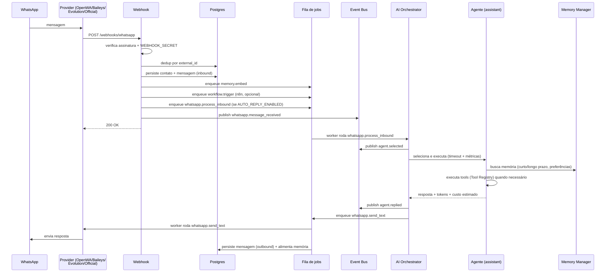

# Dario OS

Sistema operacional pessoal baseado em IA — centraliza WhatsApp, agenda, tarefas, loja, igreja, memória permanente e automações em uma única plataforma, tudo executando em Docker.

## Início rápido

```bash
./scripts/setup.sh
```

O script cria `docker/.env` (com `JWT_SECRET` gerado automaticamente) e sobe toda a stack. Depois:

| Serviço | URL |
| --- | --- |
| Dashboard | http://localhost |
| API + Swagger | http://localhost/docs |
| ReDoc | http://localhost/redoc |
| Métricas Prometheus | http://localhost/metrics |
| n8n (automações) | http://localhost/n8n/ |

Edite `docker/.env` para configurar o provedor de LLM (`OPENAI_API_KEY`, `ANTHROPIC_API_KEY` ou `GLM_API_KEY`), o provedor de WhatsApp, senha do banco e o domínio (com um domínio real o Caddy provisiona HTTPS automaticamente). As migrações Alembic rodam automaticamente na subida do backend.

## Stack

| Camada | Tecnologia |
| --- | --- |
| Backend | FastAPI (Python 3.12, SQLAlchemy 2 async, Alembic) |
| Frontend | Next.js 14 (App Router, TypeScript) |
| Banco | PostgreSQL 16 |
| Memória vetorial | Qdrant |
| Cache / filas / eventos | Redis |
| Automação | n8n |
| WhatsApp | OpenWA, Baileys, Evolution API ou WhatsApp Cloud API (plugável) |
| IA | OpenAI, Anthropic, GLM, Gemini ou Ollama (plugável) |
| Autenticação | JWT + Refresh Token rotativo + RBAC |
| Observabilidade | Logs estruturados, Prometheus, health/readiness |
| Reverse proxy | Caddy (HTTPS automático) |
| Containers | Docker Compose |

## Arquitetura

O backend segue Clean Architecture com camadas explícitas e desacopladas. Desde a Fase 3, a seleção de agente, a execução de ferramentas e a comunicação entre módulos passam por três peças centrais — **AI Orchestrator**, **Agent/Tool Registry** e **Event Bus**:

```
Rotas (FastAPI) ──→ AI Orchestrator ──→ Agent Registry ──→ BaseAgent
  (chat, agents,        │                (auto-discovery)   (planner
   webhooks)            │                                    + executor
                        │                                    + tools)
                        ▼
                   Event Bus (pub/sub)  ◄── publicado por webhooks, jobs, orquestrador
                        │
                        ▼
        Serviços (casos de uso) ──→ Repositórios ──→ Banco
                        │
                        └──→ Providers (LLM / WhatsApp) — Strategy + Factory
                        └──→ Memory Manager (curto prazo / longo prazo / conhecimento / preferências)
```

- **Repository Pattern** (`repositories/`) — todo acesso a dados passa por repositórios; o genérico `SQLAlchemyRepository` cobre CRUD e os especializados adicionam consultas de domínio.
- **Service Layer** (`auth/service.py`, `chat/service.py`, `jobs/service.py`, `memory/`) — casos de uso ficam fora das rotas.
- **Dependency Injection** — sessões, serviços e usuário autenticado entram via `Depends`; nada instancia infraestrutura dentro de rota.
- **Factory + Strategy** (`providers/*/factory.py`, `agents/registry.py`) — provedores e agentes são resolvidos por configuração/auto-discovery, nunca por `if` espalhado.
- **AI Orchestrator** (`orchestrator/`) — ponto único de seleção de agente + execução + eventos de ciclo de vida; chat e a rota `/agents/{name}/run` delegam aqui em vez de tocar `agents.registry`/`BaseAgent` diretamente.
- **Event Bus** (`events/`) — pub/sub assíncrono in-process (com fan-out best-effort via Redis) para que módulos reajam a acontecimentos sem se importarem uns aos outros. Não substitui a fila de jobs: eventos são "avise quem está ouvindo", jobs são "isso precisa acontecer e sobreviver a uma queda".
- **Memory Manager** (`memory/manager.py`) — fachada única sobre memória de curto prazo (histórico recente), longo prazo (busca semântica), conhecimento (mesma coleção, tag `knowledge`, pronta para a Fase 4) e preferências estruturadas por contato.

```
backend/
  api/            # Rotas CRUD (fábrica genérica) + dashboard + whatsapp
  auth/           # JWT, refresh token rotativo, RBAC (admin/user), service layer
  orchestrator/   # AI Orchestrator — seleção de agente + execução + eventos
  agents/         # BaseAgent + planner + executor + tools; Agent Registry (auto-discovery)
    tools/        # Tools (function calling) + Tool Registry (auto-registro)
  events/         # Event Bus (pub/sub interno, fan-out best-effort via Redis)
  chat/           # Adaptação HTTP ↔ AI Orchestrator
  memory/         # Memory Manager (fachada) + memória por contato (Qdrant)
  jobs/           # Fila durável: agendamento, retry exponencial, eventos, worker
  providers/
    llm/          # openai / anthropic / glm / gemini / ollama  (contrato LLMProvider)
    whatsapp/     # openwa / baileys / evolution / official  (contrato WhatsAppProvider)
  repositories/   # Repository pattern (genérico + especializados)
  observability/  # health/readiness, métricas Prometheus
  services/       # cache Redis, rate limit, auditoria
  webhooks/       # Entrada do WhatsApp (payload normalizado pelo provider)
  workflows/      # Integração n8n
  database/       # Engine async + base declarativa
  models/         # users, contacts, messages, church_members, store_customers,
                  # notes, calendar, tasks, embeddings, logs, refresh_tokens, jobs
  alembic/        # Migrações
  tests/          # 125 testes pytest
```

## Fluxo de execução (WhatsApp) — ponta a ponta, automático

Desde a Fase 4.1, uma mensagem recebida gera uma resposta automática sem depender de nenhuma automação externa (o n8n continua rodando em paralelo para quem já usa, mas deixou de ser obrigatório):



Se `whatsapp.process_inbound` esgotar as tentativas (LLM fora do ar, timeout persistente), um subscriber do Event Bus reage ao evento `job.failed` e envia uma mensagem de desculpas — o contato nunca fica em silêncio.

A cada N mensagens (configurável) um job `contact.summarize` atualiza o resumo automático do contato via LLM. Cada contato acumula: resumo automático, histórico, embeddings, preferências, tags e última interação — tudo acessível através do **Memory Manager**.

### Segurança e robustez do fluxo

- **Assinatura do webhook**: `WEBHOOK_SECRET` (token compartilhado, qualquer provider) e `OFFICIAL_APP_SECRET` (HMAC-SHA256 real via `X-Hub-Signature-256`, WhatsApp Cloud API).
- **Mensagens duplicadas**: dedup por `external_id` antes de processar, mais constraint única no banco (recupera de corrida entre requisições concorrentes).
- **Loop/flood**: no máximo `AUTO_REPLY_MAX_PER_CONTACT_PER_MINUTE` respostas automáticas por contato por minuto.
- **Timeout**: `AGENT_RUN_TIMEOUT_SECONDS` limita cada execução de agente; excedido, o Orchestrator publica `agent.failed` e a fila tenta de novo.
- **Retry**: herdado da fila de jobs (backoff exponencial) — nada de lógica de retry nova.
- **Nunca fica em silêncio**: falha definitiva no auto-reply dispara uma mensagem de desculpas via assinatura do Event Bus em `job.failed`.

## Agentes

| Agente | Função | Ferramentas |
| --- | --- | --- |
| `personal` | Agenda, lembretes, notas, resumos | tarefas, eventos, notas, memória |
| `church` | Oração, escalas, cultos, avisos, versículos | membros, pedidos de oração, eventos, memória |
| `store` | Produtos, pedidos, clientes, orçamentos | clientes, contatos, memória, preferências |
| `content` | Conteúdo para redes sociais | notas, memória |
| `assistant` | Atende o WhatsApp; acesso a todos os domínios | todas + envio de WhatsApp + preferências |

Cada agente possui **system prompt**, **tools** (function calling via Tool Registry), **memory** (Memory Manager — busca semântica injetada no contexto pelo planner), **planner** (monta o contexto) e **executor** (loop plan → act → observe com orçamento de iterações).

### Como adicionar um novo agente (plugin por pasta)

Instalar um agente novo não exige tocar em nenhum arquivo central:

```python
# backend/agents/weather_agent.py
from agents.base import BaseAgent
from agents.registry import register_agent

@register_agent
class WeatherAgent(BaseAgent):
    @property
    def name(self) -> str: return "weather"
    @property
    def description(self) -> str: return "Previsão do tempo"
    @property
    def system_prompt(self) -> str: return "Você informa previsão do tempo..."
    @property
    def tools(self) -> list: return [...]
```

Qualquer módulo `agents/*_agent.py` é importado automaticamente pelo Agent Registry na primeira chamada a `get_agent`/`list_agents` (`pkgutil.iter_modules`); o decorator `@register_agent` faz o resto. Nada em `agents/registry.py`, `chat/`, `orchestrator/` ou nas rotas precisa mudar — o agente aparece em `GET /api/agents` e pode ser usado em `/api/chat` e `/api/agents/{name}/run` assim que o arquivo existir.

Ferramentas seguem o mesmo espírito: declare um `Tool(...)` em `agents/tools/`, importe-o na lista `tools` do agente, e ele se auto-registra no Tool Registry (`GET /api/agents/tools` lista todas as ferramentas do sistema, de qualquer agente).

### Como adicionar um novo provedor

- **LLM**: crie `providers/llm/<nome>/provider.py` implementando `LLMProvider` (`chat` com tools + `embed`), registre no dicionário de `providers/llm/factory.py` e selecione com `LLM_PROVIDER=<nome>`. Reaproveite `OpenAIProvider` por herança quando o vendor for compatível com a API da OpenAI (caso de GLM e Ollama).
- **WhatsApp**: crie `providers/whatsapp/<nome>/provider.py` implementando `WhatsAppProvider` (5 métodos de envio + `parse_webhook` normalizando para `InboundMessage`), registre em `providers/whatsapp/factory.py` e selecione com `WHATSAPP_PROVIDER=<nome>`.

Nenhuma outra parte da aplicação muda — rotas, agentes e jobs dependem apenas dos contratos.

## Multi-LLM

| Provedor | Chat + function calling | Embeddings | Observação |
| --- | --- | --- | --- |
| `openai` | ✅ | ✅ (1536 dim, padrão) | |
| `anthropic` | ✅ | ❌ | Sem API de embeddings; use outro provedor para `EMBEDDING_PROVIDER` |
| `glm` | ✅ (via endpoint OpenAI-compatible) | ❌ | Dimensão do modelo padrão não bate com a coleção Qdrant configurada |
| `gemini` | ✅ (REST direto, sem SDK novo) | ✅ (768 dim) | Ajuste `EMBEDDING_DIMENSIONS` se usar para embeddings |
| `ollama` | ✅ (via endpoint OpenAI-compatible, local) | ❌ | Dimensão varia por modelo local; use outro provedor para embeddings |

Trocar de modelo é só configuração: `LLM_PROVIDER=gemini` (ou `ollama`, `glm`, `anthropic`) — nenhum código muda.

## Autenticação

- `POST /api/auth/register` — o primeiro usuário vira `admin`, os demais `user`.
- `POST /api/auth/login` — retorna `access_token` (curto) + `refresh_token` (rotativo, armazenado como hash SHA-256).
- `POST /api/auth/refresh` — rotaciona: o token antigo é revogado e um novo par é emitido; reuso de token revogado é rejeitado.
- `POST /api/auth/logout` — revoga o refresh token.
- Rotas administrativas (`/api/logs`, `/api/jobs`) exigem papel `admin` (`require_roles`).

## Fila de jobs

Fila durável em Postgres processada por um worker assíncrono: agendamento (`delay_seconds`), retry com backoff exponencial, eventos de ciclo de vida (`job.started`, `job.succeeded`, `job.retry_scheduled`, `job.failed`) publicados no **Event Bus** (fan-out best-effort via Redis em `darioos:events`) e sempre persistidos na tabela `logs`. Handlers registrados por decorator:

```python
from jobs.registry import job_handler

@job_handler("meu.job")
async def handler(db: AsyncSession, payload: dict) -> None: ...
```

Gerencie pela API admin: `GET/POST /api/jobs`, `POST /api/jobs/{id}/cancel`, `GET /api/jobs/handlers`.

Handlers do fluxo do WhatsApp: `memory.embed`, `contact.summarize`, `whatsapp.send_text` (envia + persiste + alimenta memória), `workflow.trigger` (n8n) e `whatsapp.process_inbound` (o auto-reply ponta a ponta — webhook → AI Orchestrator → resposta).

## Observabilidade

- `GET /health` / `GET /health/live` — liveness.
- `GET /health/ready` — readiness com verificação de Postgres (obrigatório), Redis e Qdrant (degradam sem derrubar).
- `GET /metrics` — Prometheus:
  - `darioos_http_requests_total` / `darioos_http_request_duration_seconds` — por rota.
  - `darioos_agent_runs_total{agent,provider,status}` e `darioos_agent_run_duration_seconds{agent}` — execuções de agente (tempo total por agente).
  - `darioos_agent_tool_calls_total{tool}` — ferramentas mais usadas.
  - `darioos_agent_tokens_total{provider,kind}` e `darioos_agent_cost_usd_total{provider}` — tokens consumidos e custo estimado (tabela de preços aproximada em `providers/llm/base.py`).
  - `darioos_job_duration_seconds{name}` — tempo de execução por tipo de job.
- Tempo por etapa: cada `ExecutedStep` (chamada de ferramenta) carrega seu próprio `duration_ms`, visível em `steps` na resposta de `/api/chat` e `/api/agents/{name}/run`.
- `LOG_JSON=true` — logs estruturados em JSON (padrão no Docker Compose).

## Desenvolvimento

```bash
# Backend + frontend com hot reload, sem Docker
./scripts/dev.sh

# Testes (125 testes; cobertura ~90%)
cd backend && pip install -r requirements-dev.txt && pytest
pytest --cov=. --cov-report=term    # com cobertura

# CI: GitHub Actions roda lint + testes + migrações (backend) e build (frontend) em cada PR

# Migrações
cd backend
alembic upgrade head                        # aplicar
alembic revision --autogenerate -m "..."    # criar a partir dos models
```

## Segurança

- JWT curto + refresh token rotativo (hash em banco, revogável; expirados são purgados)
- RBAC com papéis `admin`/`user`
- `WEBHOOK_SECRET`: quando definido, o webhook de entrada exige `X-Webhook-Token`
- `OFFICIAL_APP_SECRET`: verificação real de assinatura HMAC-SHA256 (`X-Hub-Signature-256`) para o provider `official` (WhatsApp Cloud API)
- Mensagens duplicadas (redelivery de webhook) são detectadas e não reprocessadas; constraint única no banco cobre a corrida entre requisições concorrentes
- Loop/flood breaker: limite de respostas automáticas por contato por minuto
- Em produção o backend se recusa a subir com `JWT_SECRET` fraca/padrão
- HTTPS automático + headers de segurança via Caddy
- Rate limit por IP (Redis, com fallback em memória; probes de health/metrics isentos)
- Senhas com PBKDF2-SHA256 salteado, verificadas fora do event loop e em tempo constante
- Backup diário: agende `scripts/backup.sh` no cron (`0 3 * * *`)

## Documentação

- [docs/architecture.md](docs/architecture.md) — arquitetura, camadas e decisões
- [docs/api.md](docs/api.md) — visão geral dos endpoints (referência completa no Swagger em `/docs`)
- [docs/fase4.1-relatorio.md](docs/fase4.1-relatorio.md) — relatório técnico do fluxo ponta a ponta do WhatsApp
