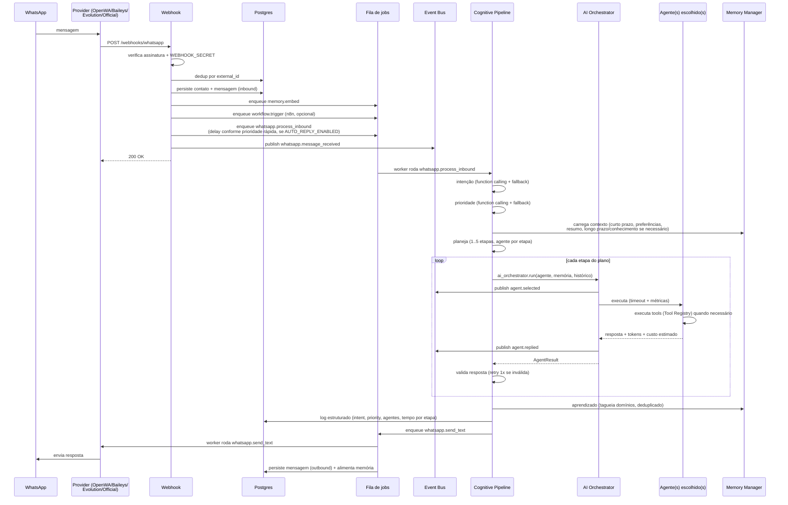

# Dario OS

Sistema operacional pessoal baseado em IA — centraliza WhatsApp, agenda, tarefas, loja, igreja, memória permanente e automações em uma única plataforma, tudo executando em Docker.

## Início rápido

```bash
./scripts/setup.sh
```

O script cria `docker/.env` (com `JWT_SECRET` gerado automaticamente) e sobe toda a stack. Depois:

| Serviço | URL |
| --- | --- |
| Dashboard | http://localhost |
| API + Swagger | http://localhost/docs |
| ReDoc | http://localhost/redoc |
| Métricas Prometheus | http://localhost/metrics |
| n8n (automações) | http://localhost/n8n/ |

Edite `docker/.env` para configurar o provedor de LLM (`OPENAI_API_KEY`, `ANTHROPIC_API_KEY` ou `GLM_API_KEY`), o provedor de WhatsApp, senha do banco e o domínio (com um domínio real o Caddy provisiona HTTPS automaticamente). As migrações Alembic rodam automaticamente na subida do backend.

## Stack

| Camada | Tecnologia |
| --- | --- |
| Backend | FastAPI (Python 3.12, SQLAlchemy 2 async, Alembic) |
| Frontend | Next.js 14 (App Router, TypeScript) |
| Banco | PostgreSQL 16 |
| Memória vetorial | Qdrant |
| Cache / filas / eventos | Redis |
| Automação | n8n |
| WhatsApp | OpenWA, Baileys, Evolution API ou WhatsApp Cloud API (plugável) |
| IA | OpenAI, Anthropic, GLM, Gemini ou Ollama (plugável) |
| Autenticação | JWT + Refresh Token rotativo + RBAC |
| Observabilidade | Logs estruturados, Prometheus, health/readiness |
| Reverse proxy | Caddy (HTTPS automático) |
| Containers | Docker Compose |

## Arquitetura

O backend segue Clean Architecture com camadas explícitas e desacopladas. Desde a Fase 3, a seleção de agente, a execução de ferramentas e a comunicação entre módulos passam por três peças centrais — **AI Orchestrator**, **Agent/Tool Registry** e **Event Bus**. Desde a Fase 4.2, o WhatsApp é atendido por um **Cognitive Pipeline** — intenção, prioridade, planejamento, validação e aprendizado, cada um um componente pequeno e independente dentro dessa mesma camada de coordenação (ver `docs/architecture.md#cognitive-pipeline-fase-42`).

```
Rotas (FastAPI) ──→ AI Orchestrator ──→ Agent Registry ──→ BaseAgent
  (chat, agents,        │                (auto-discovery)   (planner
   webhooks)            │                                    + executor
                        │                                    + tools)
                        ▼
                   Event Bus (pub/sub)  ◄── publicado por webhooks, jobs, orquestrador
                        │
                        ▼
        Serviços (casos de uso) ──→ Repositórios ──→ Banco
                        │
                        └──→ Providers (LLM / WhatsApp) — Strategy + Factory
                        └──→ Memory Manager (curto prazo / longo prazo / conhecimento / preferências)
```

- **Repository Pattern** (`repositories/`) — todo acesso a dados passa por repositórios; o genérico `SQLAlchemyRepository` cobre CRUD e os especializados adicionam consultas de domínio.
- **Service Layer** (`auth/service.py`, `chat/service.py`, `jobs/service.py`, `memory/`) — casos de uso ficam fora das rotas.
- **Dependency Injection** — sessões, serviços e usuário autenticado entram via `Depends`; nada instancia infraestrutura dentro de rota.
- **Factory + Strategy** (`providers/*/factory.py`, `agents/registry.py`) — provedores e agentes são resolvidos por configuração/auto-discovery, nunca por `if` espalhado.
- **AI Orchestrator** (`orchestrator/`) — ponto único de seleção de agente + execução + eventos de ciclo de vida; chat e a rota `/agents/{name}/run` delegam aqui em vez de tocar `agents.registry`/`BaseAgent` diretamente.
- **Event Bus** (`events/`) — pub/sub assíncrono in-process (com fan-out best-effort via Redis) para que módulos reajam a acontecimentos sem se importarem uns aos outros. Não substitui a fila de jobs: eventos são "avise quem está ouvindo", jobs são "isso precisa acontecer e sobreviver a uma queda".
- **Memory Manager** (`memory/manager.py`) — fachada única sobre memória de curto prazo (histórico recente), longo prazo (busca semântica), conhecimento (mesma coleção, tag `knowledge` — consultada de verdade pela primeira vez na Fase 4.2), resumo do contato e preferências estruturadas.
- **Cognitive Pipeline** (`orchestrator/intent.py`, `priority.py`, `planning.py`, `validation.py`, `learning.py`, `pipeline.py`) — Fase 4.2: intenção e prioridade classificadas por function calling (com degradação honesta para heurística quando o LLM não responde), um Planner que decide etapas/agentes/confirmação, validação determinística com retry bounded, e aprendizado que tagueia domínios recorrentes do contato. Ver `docs/AGENTS.md`, `docs/TOOLS.md`, `docs/MEMORY.md`, `docs/WORKFLOWS.md` para a referência completa por assunto.

```
backend/
  api/            # Rotas CRUD (fábrica genérica) + dashboard + whatsapp
  auth/           # JWT, refresh token rotativo, RBAC (admin/user), service layer
  orchestrator/   # AI Orchestrator (seleção + execução + eventos) e o Cognitive
                  # Pipeline (intent, priority, planning, validation, learning)
  agents/         # BaseAgent + planner + executor + tools; Agent Registry (auto-discovery)
    tools/        # Tools (function calling) + Tool Registry (auto-registro)
  events/         # Event Bus (pub/sub interno, fan-out best-effort via Redis)
  chat/           # Adaptação HTTP ↔ AI Orchestrator
  memory/         # Memory Manager (fachada) + memória por contato (Qdrant)
  jobs/           # Fila durável: agendamento, retry exponencial, eventos, worker
  mail/           # Rotas OAuth do Gmail: connect/callback/status/disconnect (admin-only)
  gcalendar/      # Rotas OAuth do Google Calendar (admin-only)
  gcontacts/      # Rotas OAuth do Google Contacts (admin-only)
  gdrive/         # Rotas OAuth do Google Drive (admin-only)
  providers/
    llm/          # openai / anthropic / glm / gemini / ollama  (contrato LLMProvider)
    whatsapp/     # openwa / baileys / evolution / official  (contrato WhatsAppProvider)
    mail/         # gmail  (contrato MailProvider) — somente leitura, ver docs/EMAIL.md
    calendar/     # google  (contrato CalendarProvider) — leitura+escrita, ver docs/CALENDAR.md
    contacts/     # google  (contrato ContactsProvider) — leitura+escrita, ver docs/CONTACTS.md
    drive/        # google  (contrato DriveProvider) — somente leitura, ver docs/DRIVE.md
  repositories/   # Repository pattern (genérico + especializados)
  observability/  # health/readiness, métricas Prometheus
  services/       # cache Redis, rate limit, auditoria
  webhooks/       # Entrada do WhatsApp (payload normalizado pelo provider)
  workflows/      # Integração n8n
  database/       # Engine async + base declarativa
  models/         # users, contacts, messages, church_members, store_customers,
                  # notes, calendar, tasks, embeddings, logs, refresh_tokens, jobs,
                  # email_accounts, google_calendar_accounts, google_contacts_accounts,
                  # google_drive_accounts, google_drive_indexed_files
  utils/          # Settings (config.py) + logging estruturado (logging.py)
  alembic/        # Migrações
  tests/          # 473 testes pytest
```

## Fluxo de execução (WhatsApp) — ponta a ponta, automático

Desde a Fase 4.1, uma mensagem recebida gera uma resposta automática sem depender de nenhuma automação externa (o n8n continua rodando em paralelo para quem já usa, mas deixou de ser obrigatório). Desde a Fase 4.2, quem processa essa mensagem é o **Cognitive Pipeline** — pensa antes de agir em vez de ir direto para um agente fixo:



Se `whatsapp.process_inbound` esgotar as tentativas (LLM fora do ar, timeout persistente), um subscriber do Event Bus reage ao evento `job.failed` e envia uma mensagem de desculpas — o contato nunca fica em silêncio.

A cada N mensagens (configurável) um job `contact.summarize` atualiza o resumo automático do contato via LLM. Cada contato acumula: resumo automático, histórico, embeddings, preferências, tags e última interação — tudo acessível através do **Memory Manager**. Detalhes do Cognitive Pipeline (intenção, prioridade, planejamento, validação, aprendizado): `docs/architecture.md#cognitive-pipeline-fase-42`.

### Segurança e robustez do fluxo

- **Assinatura do webhook**: `WEBHOOK_SECRET` (token compartilhado, qualquer provider) e `OFFICIAL_APP_SECRET` (HMAC-SHA256 real via `X-Hub-Signature-256`, WhatsApp Cloud API).
- **Mensagens duplicadas**: dedup por `external_id` antes de processar, mais constraint única no banco (recupera de corrida entre requisições concorrentes).
- **Mensagens fora de ordem**: histórico ordenado pelo timestamp do próprio evento do gateway (`InboundMessage.timestamp`), não pela ordem de chegada do webhook — uma redelivery atrasada não bagunça o contexto do agente.
- **Retry com backoff exponencial**: toda chamada HTTP de um Provider ao seu gateway passa por um helper compartilhado (`WhatsAppProvider._request`) com retry automático — nenhum provider duplica essa lógica.
- **Sessão e reconexão**: mudanças de estado da sessão do gateway (conectado, deslogado, reconectando) são normalizadas (`ConnectionEvent`) e registradas (log + métrica + Event Bus `whatsapp.session_changed`); uma sessão deslogada (`AUTH_EXPIRED`) emite um log de erro pedindo re-pareamento humano — o sistema não finge uma reconexão automática que a tecnologia (WhatsApp Web) não oferece.
- **Confirmação de entrega**: quando o gateway suporta, `DeliveryAck` normalizado atualiza o status da mensagem enviada (`sent`/`delivered`/`read`/`failed`) e publica `whatsapp.message_delivery_ack`.
- **Loop/flood**: no máximo `AUTO_REPLY_MAX_PER_CONTACT_PER_MINUTE` respostas automáticas por contato por minuto.
- **Timeout**: `AGENT_RUN_TIMEOUT_SECONDS` limita cada execução de agente; excedido, o Orchestrator publica `agent.failed` e a fila tenta de novo.
- **Retry (auto-reply)**: herdado da fila de jobs (backoff exponencial) — nada de lógica de retry nova.
- **Nunca fica em silêncio**: falha definitiva no auto-reply dispara uma mensagem de desculpas via assinatura do Event Bus em `job.failed`; mesmo esgotando as tentativas de validação de uma etapa, o Cognitive Pipeline devolve a melhor resposta disponível em vez de nada.
- **Troca automática de provider**: `AgentExecutor` intercepta uma exceção do provider LLM configurado e tenta uma vez com `LLM_FALLBACK_PROVIDER` (se configurado) — sem fallback, o comportamento é o de sempre.
- **Testes de compatibilidade**: `tests/test_whatsapp_provider_compatibility.py` garante que qualquer Provider que implemente a interface (inclusive um novo, nunca visto antes) funciona automaticamente com o webhook e o envio, sem alterar código de aplicação.

## Agentes

| Agente | Função | Ferramentas |
| --- | --- | --- |
| `personal` | Agenda, lembretes, notas, resumos | tarefas, eventos, notas, memória |
| `church` | Oração, escalas, cultos, avisos, versículos | membros, pedidos de oração, eventos, memória |
| `store` | Produtos, pedidos, clientes, orçamentos | clientes, contatos, memória, preferências |
| `content` | Conteúdo para redes sociais | notas, memória |
| `assistant` | Atende o WhatsApp; acesso a todos os domínios | todas + envio de WhatsApp + preferências + e-mail (Gmail, somente leitura) + Google Calendar + Google Contacts + Google Drive (base de conhecimento) |

Cada agente possui **system prompt**, **tools** (function calling via Tool Registry), **memory** (Memory Manager — busca semântica injetada no contexto pelo planner), **planner** (monta o contexto) e **executor** (loop plan → act → observe com orçamento de iterações).

### Como adicionar um novo agente (plugin por pasta)

Instalar um agente novo não exige tocar em nenhum arquivo central:

```python
# backend/agents/weather_agent.py
from agents.base import BaseAgent
from agents.registry import register_agent

@register_agent
class WeatherAgent(BaseAgent):
    @property
    def name(self) -> str: return "weather"
    @property
    def description(self) -> str: return "Previsão do tempo"
    @property
    def system_prompt(self) -> str: return "Você informa previsão do tempo..."
    @property
    def tools(self) -> list: return [...]
```

Qualquer módulo `agents/*_agent.py` é importado automaticamente pelo Agent Registry na primeira chamada a `get_agent`/`list_agents` (`pkgutil.iter_modules`); o decorator `@register_agent` faz o resto. Nada em `agents/registry.py`, `chat/`, `orchestrator/` ou nas rotas precisa mudar — o agente aparece em `GET /api/agents` e pode ser usado em `/api/chat` e `/api/agents/{name}/run` assim que o arquivo existir.

Ferramentas seguem o mesmo espírito: declare um `Tool(...)` em `agents/tools/`, importe-o na lista `tools` do agente, e ele se auto-registra no Tool Registry (`GET /api/agents/tools` lista todas as ferramentas do sistema, de qualquer agente).

### Como adicionar um novo provedor

- **LLM**: crie `providers/llm/<nome>/provider.py` implementando `LLMProvider` (`chat` com tools + `embed`), registre no dicionário de `providers/llm/factory.py` e selecione com `LLM_PROVIDER=<nome>`. Reaproveite `OpenAIProvider` por herança quando o vendor for compatível com a API da OpenAI (caso de GLM e Ollama).
- **WhatsApp**: crie `providers/whatsapp/<nome>/provider.py` implementando `WhatsAppProvider` (5 métodos de envio + `parse_webhook` normalizando para `InboundMessage`), registre em `providers/whatsapp/factory.py` e selecione com `WHATSAPP_PROVIDER=<nome>`. Guia completo (contrato, exemplo mínimo, checklist de testes de compatibilidade): [`backend/providers/whatsapp/README.md`](backend/providers/whatsapp/README.md).
- **E-mail**: crie `providers/mail/<nome>/provider.py` implementando `MailProvider` (OAuth + `search`/`get_thread`), registre em `providers/mail/factory.py` e selecione com `MAIL_PROVIDER=<nome>`. Hoje só `gmail` existe. Guia completo: [`docs/EMAIL.md`](docs/EMAIL.md).
- **Calendário**: crie `providers/calendar/<nome>/provider.py` implementando `CalendarProvider`, registre em `providers/calendar/factory.py` e selecione com `CALENDAR_PROVIDER=<nome>`. Hoje só `google` existe. Guia completo: [`docs/CALENDAR.md`](docs/CALENDAR.md).
- **Contatos**: crie `providers/contacts/<nome>/provider.py` implementando `ContactsProvider`, registre em `providers/contacts/factory.py` e selecione com `CONTACTS_PROVIDER=<nome>`. Hoje só `google` existe. Guia completo: [`docs/CONTACTS.md`](docs/CONTACTS.md).
- **Drive**: crie `providers/drive/<nome>/provider.py` implementando `DriveProvider`, registre em `providers/drive/factory.py` e selecione com `DRIVE_PROVIDER=<nome>`. Hoje só `google` existe. Guia completo: [`docs/DRIVE.md`](docs/DRIVE.md).

Nenhuma outra parte da aplicação muda — rotas, agentes e jobs dependem apenas dos contratos.

## Multi-LLM

| Provedor | Chat + function calling | Embeddings | Observação |
| --- | --- | --- | --- |
| `openai` | ✅ | ✅ (1536 dim, padrão) | |
| `anthropic` | ✅ | ❌ | Sem API de embeddings; use outro provedor para `EMBEDDING_PROVIDER` |
| `glm` | ✅ (via endpoint OpenAI-compatible) | ❌ | Dimensão do modelo padrão não bate com a coleção Qdrant configurada |
| `gemini` | ✅ (REST direto, sem SDK novo) | ✅ (768 dim) | Ajuste `EMBEDDING_DIMENSIONS` se usar para embeddings |
| `ollama` | ✅ (via endpoint OpenAI-compatible, local) | ❌ | Dimensão varia por modelo local; use outro provedor para embeddings |

Trocar de modelo é só configuração: `LLM_PROVIDER=gemini` (ou `ollama`, `glm`, `anthropic`) — nenhum código muda.

**Troca automática em caso de falha** (Fase 4.2): `LLM_FALLBACK_PROVIDER=<nome>` faz o `AgentExecutor` tentar esse provedor uma vez sempre que `LLM_PROVIDER` levantar uma exceção em vez de simplesmente degradar (ex.: rede fora do ar, chave expirada) — vazio por padrão, comportamento idêntico ao de antes da Fase 4.2.

## E-mail (Gmail)

Domínio novo e isolado (Sprint 1), somente leitura: buscar, ler, resumir e detectar pendências em e-mails do Gmail. Enviar, responder, mover, excluir e re-rotular estão fora do escopo. Só o agente `assistant` tem acesso direto às ferramentas de e-mail — qualquer outro agente que precise desse contexto passa pelo Cognitive Planner, que roteia a etapa para `assistant`, em vez de ganhar acesso próprio ao domínio.

Configuração (`MAIL_PROVIDER`, `GOOGLE_CLIENT_ID`, `GOOGLE_CLIENT_SECRET`, `GOOGLE_REDIRECT_URI`, `EMAIL_TOKEN_ENCRYPTION_KEY`) e o passo a passo completo de setup no Google Cloud Console: **[`docs/EMAIL.md`](docs/EMAIL.md)**.

## Google Calendar e Google Contacts

Dois domínios novos e isolados (Sprint 2), leitura **e** escrita: agendas/eventos (listar, buscar, criar, editar, excluir, verificar conflitos/disponibilidade) e contatos (listar, buscar, criar, editar, remover) do Google real do usuário — não confundir com a agenda interna (`/api/calendar`) nem com os contatos de WhatsApp (`/api/contacts`) que o Dario OS já tinha antes. Mesmo padrão do Gmail: só `assistant` tem acesso direto às ferramentas; reaproveitam o mesmo app OAuth do Google Cloud já criado para o Gmail (só mais uma URI de redirecionamento e um escopo, cadastrados no mesmo app, por domínio).

Configuração e passo a passo: **[`docs/CALENDAR.md`](docs/CALENDAR.md)** (`CALENDAR_PROVIDER`, `GOOGLE_CALENDAR_REDIRECT_URI`) e **[`docs/CONTACTS.md`](docs/CONTACTS.md)** (`CONTACTS_PROVIDER`, `GOOGLE_CONTACTS_REDIRECT_URI`).

## Google Drive (base de conhecimento)

Domínio novo e isolado (Sprint 3): o Google Drive como base oficial de conhecimento do Dario OS. Lista, busca, lê (PDF, DOCX, TXT, Markdown, CSV) e indexa arquivos — a indexação alimenta exclusivamente o Memory Manager/Qdrant que já existiam (mesma coleção, tag `knowledge`), sem nenhum banco ou mecanismo de conhecimento novo. Perguntas como "qual documento fala sobre investimentos?" já são respondidas pela ferramenta `search_memory` existente, assim que os arquivos relevantes forem indexados — nenhuma tool de busca de conhecimento nova foi criada. Google Docs, Sheets, Slides, Meet, Tasks e Keep estão fora do escopo. Mesmo padrão de gateway único (`assistant`) e reaproveitamento do app OAuth do Gmail.

Configuração e passo a passo: **[`docs/DRIVE.md`](docs/DRIVE.md)** (`DRIVE_PROVIDER`, `GOOGLE_DRIVE_REDIRECT_URI`, `GDRIVE_MAX_FILE_SIZE_BYTES`).

## Autenticação

- `POST /api/auth/register` — o primeiro usuário vira `admin`, os demais `user`.
- `POST /api/auth/login` — retorna `access_token` (curto) + `refresh_token` (rotativo, armazenado como hash SHA-256).
- `POST /api/auth/refresh` — rotaciona: o token antigo é revogado e um novo par é emitido; reuso de token revogado é rejeitado.
- `POST /api/auth/logout` — revoga o refresh token.
- Rotas administrativas (`/api/logs`, `/api/jobs`) exigem papel `admin` (`require_roles`).

## Fila de jobs

Fila durável em Postgres processada por um worker assíncrono: agendamento (`delay_seconds`), retry com backoff exponencial, eventos de ciclo de vida (`job.started`, `job.succeeded`, `job.retry_scheduled`, `job.failed`) publicados no **Event Bus** (fan-out best-effort via Redis em `darioos:events`) e sempre persistidos na tabela `logs`. Handlers registrados por decorator:

```python
from jobs.registry import job_handler

@job_handler("meu.job")
async def handler(db: AsyncSession, payload: dict) -> None: ...
```

Gerencie pela API admin: `GET/POST /api/jobs`, `POST /api/jobs/{id}/cancel`, `GET /api/jobs/handlers`.

Handlers do fluxo do WhatsApp: `memory.embed`, `contact.summarize`, `whatsapp.send_text` (envia + persiste + alimenta memória), `workflow.trigger` (n8n) e `whatsapp.process_inbound` (o auto-reply ponta a ponta — webhook → AI Orchestrator → resposta).

## Observabilidade

- `GET /health` / `GET /health/live` — liveness.
- `GET /health/ready` — readiness com verificação de Postgres (obrigatório), Redis, Qdrant e o Provider de WhatsApp configurado (degradam sem derrubar).
- `GET /metrics` — Prometheus:
  - `darioos_http_requests_total` / `darioos_http_request_duration_seconds` — por rota.
  - `darioos_agent_runs_total{agent,provider,status}` e `darioos_agent_run_duration_seconds{agent}` — execuções de agente (tempo total por agente).
  - `darioos_agent_tool_calls_total{tool,status}` — ferramentas mais usadas, com status (`ok`/`error`).
  - `darioos_agent_tokens_total{provider,kind}` e `darioos_agent_cost_usd_total{provider}` — tokens consumidos e custo estimado (tabela de preços aproximada em `providers/llm/base.py`).
  - `darioos_job_duration_seconds{name}` — tempo de execução por tipo de job.
  - `darioos_whatsapp_provider_requests_total{provider,status}` e `darioos_whatsapp_session_status{provider}` — disponibilidade do gateway de WhatsApp (chamadas HTTP e estado da sessão).
  - `darioos_pipeline_stage_duration_seconds{stage}` e `darioos_pipeline_run_duration_seconds` — tempo por etapa e tempo total do Cognitive Pipeline (Fase 4.2).
  - `darioos_intent_classifications_total{intent}` e `darioos_priority_classifications_total{priority}` — distribuição de intenções e prioridades classificadas.
  - `darioos_pipeline_validation_retries_total` e `darioos_pipeline_memory_lookups_total{kind}` — quantas vezes a validação pediu uma nova tentativa, e quais tipos de memória foram consultados.
- Tempo por etapa: cada `ExecutedStep` (chamada de ferramenta) carrega seu próprio `duration_ms`, visível em `steps` na resposta de `/api/chat` e `/api/agents/{name}/run`; o Cognitive Pipeline expõe o mesmo detalhamento por etapa em `stage_durations_ms`, além de registrar tudo (intenção, prioridade, agentes usados, tempos) em um log estruturado (`source=cognitive_pipeline`) por conversa.
- `LOG_JSON=true` — logs estruturados em JSON (padrão no Docker Compose), com `request_id` em toda linha emitida durante uma requisição (Sprint 5).
- **Correlation/Request ID**: toda resposta HTTP carrega `X-Request-ID` (gerado ou ecoado do cliente) — permite filtrar todos os logs de um incidente por um único ID. Sprint 5.
- **Tracing (OpenTelemetry)**: opcional, `OTEL_ENABLED=false` por padrão (zero overhead); auto-instrumenta FastAPI, SQLAlchemy e httpx quando ligado. Sprint 5. Detalhes: [`OBSERVABILITY_GUIDE.md`](OBSERVABILITY_GUIDE.md).

## Dashboard Administrativo

Painel administrativo (Sprint 4), somente leitura, em `/admin` — status dos
sistemas, agentes e tools registrados, timeline de execuções, memória (Qdrant/
embeddings), Google Workspace, WhatsApp, usuários, logs, métricas e
informações de sistema, no estilo de LangSmith/Grafana/Datadog. Exclusivo para
`role=admin`. Construído inteiramente sobre dados que já existiam (Agent/Tool
Registry, tabelas já existentes, métricas Prometheus já expostas) — nenhuma
regra de negócio foi alterada. Detalhes completos, incluindo as limitações de
dados assumidas explicitamente (não há auditoria de execução por tool nem QR
code do WhatsApp nesta versão): **[`docs/DASHBOARD.md`](docs/DASHBOARD.md)**.

## Desenvolvimento

```bash
# Backend + frontend com hot reload, sem Docker
./scripts/dev.sh

# Testes backend (555 testes; cobertura ~94%)
cd backend && pip install -r requirements-dev.txt && pytest
pytest --cov=. --cov-report=term    # com cobertura

# Testes frontend (108 testes; cobertura ~95% em components/admin, lib e hooks)
cd frontend && npm test
npm run test:coverage               # com cobertura

# Testes E2E (Playwright — 23 testes: login, responsividade, acessibilidade,
# navegação por teclado, loading/error states, performance) — Sprint 5
cd frontend && npm run e2e

# CI: GitHub Actions roda lint + testes + migrações (backend) e build (frontend) em cada PR

# Migrações
cd backend
alembic upgrade head                        # aplicar
alembic revision --autogenerate -m "..."    # criar a partir dos models
```

## Segurança

- JWT curto + refresh token rotativo (hash em banco, revogável; expirados são purgados)
- RBAC com papéis `admin`/`user`
- `WEBHOOK_SECRET`: quando definido, o webhook de entrada exige `X-Webhook-Token`
- `OFFICIAL_APP_SECRET`: verificação real de assinatura HMAC-SHA256 (`X-Hub-Signature-256`) para o provider `official` (WhatsApp Cloud API)
- Mensagens duplicadas (redelivery de webhook) são detectadas e não reprocessadas; constraint única no banco cobre a corrida entre requisições concorrentes
- Loop/flood breaker: limite de respostas automáticas por contato por minuto
- `WHATSAPP_REQUEST_MAX_ATTEMPTS`/`WHATSAPP_REQUEST_BACKOFF_SECONDS`: retry com backoff exponencial para toda chamada HTTP de um Provider de WhatsApp ao seu gateway
- Em produção o backend se recusa a subir com `JWT_SECRET`/`WEBHOOK_SECRET` fraca/ausente
- HTTPS automático + headers de segurança via Caddy
- Rate limit por IP (Redis, com fallback em memória; probes de health/metrics isentos)
- Senhas com PBKDF2-SHA256 salteado, verificadas fora do event loop e em tempo constante
- Backup diário: agende `scripts/backup.sh` no cron (`0 3 * * *`)
- Refresh token do Gmail cifrado em repouso (Fernet, `EMAIL_TOKEN_ENCRYPTION_KEY`); nenhuma credencial de terceiro é persistida em texto puro
- Isolamento técnico entre usuários/contatos decidido em código, nunca só pelo prompt do LLM (WhatsApp: PROD-005; e-mail/Calendar/Contacts/Drive: Sprint 1-3) — ver [`SECURITY.md`](SECURITY.md) para o modelo de segurança completo

## Documentação

- [docs/architecture.md](docs/architecture.md) — arquitetura, camadas e decisões
- [docs/api.md](docs/api.md) — visão geral dos endpoints (referência completa no Swagger em `/docs`)
- [docs/AGENTS.md](docs/AGENTS.md) — agentes: anatomia, catálogo, como instalar um novo, como são escolhidos
- [docs/TOOLS.md](docs/TOOLS.md) — ferramentas: contrato, Tool Registry, fluxo de seleção/execução, catálogo
- [docs/MEMORY.md](docs/MEMORY.md) — os seis tipos de memória, ciclo de vida de uma mensagem, aprendizado
- [docs/WORKFLOWS.md](docs/WORKFLOWS.md) — fila de jobs, hand-off n8n, o Cognitive Pipeline como workflow do WhatsApp
- [docs/EMAIL.md](docs/EMAIL.md) — integração Gmail: arquitetura, isolamento, ferramentas, setup OAuth passo a passo
- [docs/CALENDAR.md](docs/CALENDAR.md) — integração Google Calendar: arquitetura, isolamento, ferramentas, setup OAuth passo a passo
- [docs/CONTACTS.md](docs/CONTACTS.md) — integração Google Contacts: arquitetura, isolamento, ferramentas, setup OAuth passo a passo
- [docs/DRIVE.md](docs/DRIVE.md) — Google Drive como base de conhecimento: arquitetura, integração com o Memory Manager existente, isolamento, ferramentas, setup OAuth passo a passo
- [docs/DASHBOARD.md](docs/DASHBOARD.md) — Dashboard Administrativo: arquitetura, endpoints e a fonte real de cada dado, limitações assumidas, segurança, testes
- [SECURITY.md](SECURITY.md) — modelo de segurança consolidado (autenticação, isolamento, segredos, checklist de produção)
- [docs/fase4.1-relatorio.md](docs/fase4.1-relatorio.md) — relatório técnico do fluxo ponta a ponta do WhatsApp
- [docs/fase4.2-relatorio.md](docs/fase4.2-relatorio.md) — relatório técnico do Cognitive Pipeline
- [OBSERVABILITY_GUIDE.md](OBSERVABILITY_GUIDE.md) — Correlation ID, logging estruturado, tracing OpenTelemetry (Sprint 5)
- [OPERATIONS_RUNBOOK.md](OPERATIONS_RUNBOOK.md) / [DISASTER_RECOVERY.md](DISASTER_RECOVERY.md) — operação contínua, backup/restore, resposta a incidentes
- [VERSION_HISTORY.md](VERSION_HISTORY.md) / [PROJECT_STATUS.md](PROJECT_STATUS.md) / [ROADMAP_v2.md](ROADMAP_v2.md) — linha do tempo, status atual e planejamento futuro
- [CONTRIBUTING.md](CONTRIBUTING.md) — padrões do projeto, como criar Agents/Providers/Tools, testes e migrations
