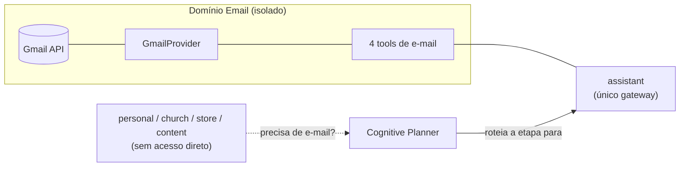
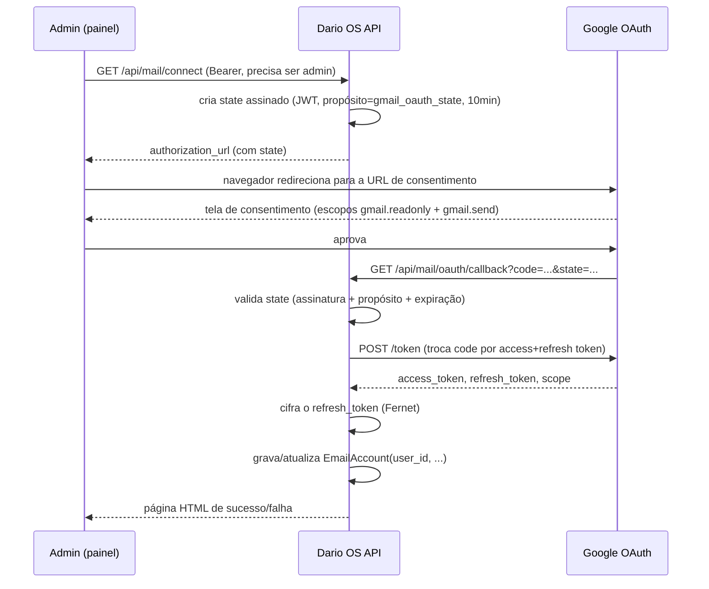

# E-mail (Gmail)

Domínio isolado do resto do Dario OS para leitura e resposta de e-mail via Gmail: buscar, ler, resumir, detectar pendências e **responder** (dentro de uma conversa já existente). Compor um e-mail novo para um endereço arbitrário, mover, excluir ou re-rotular mensagens continuam **fora do escopo** e não existem em nenhum ponto do código.

## Objetivo e escopo

| Funcionalidade | Status |
| --- | --- |
| Buscar e-mails (remetente, assunto, período, palavras-chave, etiqueta) | ✅ |
| Ler o conteúdo completo de uma conversa (thread) | ✅ |
| Resumir uma conversa longa | ✅ (via LLM) |
| Detectar pendências (responder, enviar proposta, agendar reunião) | ✅ (via function calling) |
| Criar tarefa/evento a partir de um e-mail | ✅ — mas só quando o dono pede na conversa; reaproveita `create_task`/`create_calendar_event` já existentes, este domínio nunca os chama sozinho |
| Responder a uma conversa existente (`reply_to_email_thread`) | ✅ — destinatário sempre resolvido do remetente da última mensagem da própria thread, nunca informado pelo modelo (mesmo princípio do PROD-005) |
| Compor e-mail novo para endereço arbitrário, mover, excluir, re-rotular | ❌ fora do escopo |

## Gateway único: o agente `assistant`

**Somente o agente `assistant` tem acesso direto às ferramentas de Gmail.** Nenhum outro agente (`personal`, `church`, `store`, `content`) importa ou lista uma tool de e-mail — ver `agents/assistant_agent.py`, a única linha de `tools` que inclui `search_emails_tool`, `read_email_thread_tool`, `summarize_email_thread_tool` e `detect_pending_email_actions_tool`.

Se um agente especializado precisar de algo do e-mail (ex.: o agente `store` quer saber se um cliente respondeu um orçamento), ele **não** ganha acesso direto — a etapa correspondente do plano do **Cognitive Planner** é roteada para `assistant`, exatamente como qualquer outro plano multi-etapa hoje (`orchestrator/planning.py`). Nenhum mecanismo novo de comunicação entre agentes foi criado para isso; o domínio de e-mail simplesmente participa do mesmo Cognitive Pipeline que todo o resto do sistema já usa.



## Por que "mail", não "email"

`providers/mail/` e `backend/mail/` — não `email` — porque `email` é um módulo da biblioteca padrão do Python (`email.utils`, usado dentro do próprio `GmailProvider` para parsear a data MIME); nomear o pacote da aplicação igual sombrearia o stdlib em qualquer import relativo. Mesma preocupação, solução diferente da mais óbvia.

## Arquitetura

```
providers/mail/
  base.py            MailProvider (Strategy) — authorization_url, exchange_code,
                      refresh_access_token, search, get_thread, send_reply
                      + EmailMessage, EmailThread, EmailSearchQuery, OAuthTokens
  factory.py          get_mail_provider() — seleciona por MAIL_PROVIDER (hoje só "gmail")
  gmail/provider.py   GmailProvider — REST via httpx puro (mesma escolha já feita
                      para o provider Gemini: httpx já é dependência, não vale a
                      pena puxar google-api-python-client + google-auth para um
                      punhado de endpoints)

mail/
  router.py           /api/mail/connect, /oauth/callback, /status, /disconnect
  schemas.py           MailConnectResponse, MailStatusResponse

models/email_account.py    EmailAccount — um mailbox autorizado por (user, provider)
repositories/email_account.py   EmailAccountRepository.get_by_user(user_id, provider)

services/token_crypto.py   encrypt_token/decrypt_token (Fernet) — refresh token
                            nunca é persistido em texto puro

jobs/handlers.py            mail.send_reply — job durável que efetivamente envia a
                            resposta (retry/backoff em falha transitória do Gmail,
                            mesmo padrão do whatsapp.send_text)

agents/tools/mail.py        as 5 tools — registradas só em assistant_agent.py
```

Um Provider só traduz e transporta (mesmo princípio já documentado para WhatsApp em `docs/architecture.md#providers`): `GmailProvider` nunca acessa o banco, nunca chama o LLM, nunca decide autorização — ele converte a forma da API REST do Gmail para os três tipos neutros (`EmailMessage`, `EmailThread`, `OAuthTokens`) e nada mais. Autorização, criptografia e chamadas ao LLM ficam em `mail/router.py` e `agents/tools/mail.py`.

### Modelo de dados

```
email_accounts
  id
  user_id              FK -> users.id (ondelete CASCADE)
  provider              "gmail"
  email_address          rótulo amigável (best-effort — não usado para autorização)
  encrypted_refresh_token TEXT, cifrado com Fernet (services/token_crypto.py)
  scopes                 JSON — os escopos que o Google efetivamente concedeu
  connected_at
  UNIQUE (user_id, provider)
```

Uma linha por `(user, provider)` — reconectar atualiza a linha existente em vez de duplicar.

## Fluxo de autorização (OAuth 2.0 Authorization Code)

`/connect`, `/status` e `/disconnect` são **admin-only** (`require_admin`) — configuração feita pelo painel, não uma superfície de conversa. `/oauth/callback` é a única rota que o próprio Google chama (redirecionamento puro do navegador, sem cabeçalho `Authorization` possível); ela se autentica de um jeito diferente: um `state` assinado e de curta duração, emitido por `/connect` (`auth/jwt.py::create_oauth_state_token`, reaproveita `JWT_SECRET` — nenhum segredo novo) e validado no callback (`purpose=gmail_oauth_state`, expira em 10 minutos).



Se o Google não devolver um `refresh_token` (acontece quando a conta já concedeu consentimento antes e o Google não reemite por padrão), a conexão falha explicitamente pedindo para revogar o acesso anterior em `myaccount.google.com/permissions` e tentar de novo — `authorization_url` já envia `prompt=consent` para minimizar esse caso, mas o servidor não finge sucesso sem o refresh token.

## Segurança e isolamento (mesmos princípios do PROD-005)

O mesmo princípio técnico do PROD-005 (isolamento de contato do WhatsApp) se aplica aqui a mailboxes: **a autorização é decidida em código, nunca só pelo prompt do modelo.**

- **`_get_access_token(context)`** (`agents/tools/mail.py`) é o único lugar em todo o domínio onde um mailbox é escolhido — sempre a partir de `context.user.id`, que é preenchido pela aplicação (`BaseAgent.run`), nunca pelo LLM. Nenhuma das quatro tools tem um parâmetro de usuário/mailbox no seu JSON Schema — não existe argumento que um modelo manipulado possa fornecer para alcançar a caixa de entrada de outra pessoa.
- Se o usuário atual não tiver uma conta conectada, `MailNotConnectedError` vira o mesmo envelope de erro estruturado de qualquer outra falha de tool (`{"error": "..."}"`) — nunca uma exceção não tratada, nunca um fallback silencioso para a conta de outro usuário.
- **Credenciais nunca em texto puro**: o refresh token é cifrado em repouso com Fernet (AES-128-CBC + HMAC autenticado) usando `EMAIL_TOKEN_ENCRYPTION_KEY`, uma chave que só existe em configuração, nunca no banco. Sem a chave configurada, `encrypt_token`/`decrypt_token` recusam operar (`TokenEncryptionNotConfigured`) em vez de cair para um caminho inseguro.
- **Escopo mínimo**: a integração pede exatamente `gmail.readonly` + `gmail.send` — nunca `gmail.modify`/`gmail.compose`, que também dariam apagar/re-rotular/rascunhar qualquer coisa. Contas conectadas antes do escopo `gmail.send` existir precisam reconectar (botão "Reconnect" em `/admin/google`) antes que `reply_to_email_thread` funcione — `_get_access_token(context, require_send_scope=True)` verifica `gmail.send` em `EmailAccount.scopes` (persistido no connect, já que a resposta do refresh grant do Google não repete `scope`) e recusa explicitamente com uma mensagem acionável antes de sequer tentar enviar.
- **Sem "compor e-mail novo"**: nenhuma tool aceita um endereço de destino arbitrário. `reply_to_email_thread` resolve o destinatário sempre do remetente da última mensagem da própria thread (`agents/tools/mail.py::_reply_to_email_thread`) — o mesmo princípio do PROD-005 aplicado ao WhatsApp. O envio em si é enfileirado (`mail.send_reply`, job durável) em vez de síncrono, para sobreviver a uma instabilidade transitória do Gmail.
- **`/connect`, `/status`, `/disconnect` são admin-only** — conectar/desconectar uma conta de Gmail é uma decisão de configuração do dono da instância, não algo que qualquer usuário autenticado possa disparar.
- Testes de isolamento entre usuários (`backend/tests/test_mail_tools.py`) provam isso na prática, não só na leitura do código: dois usuários conectados a mailboxes diferentes, mesma chamada de tool, tokens de acesso resolvidos nunca se cruzam — inclusive o caso em que o modelo tenta usar o `thread_id` de um usuário na conversa de outro (rejeitado, porque a Gmail API já escopa threads pelo access_token — o comportamento é idêntico a um 404 real do Gmail).

## Ferramentas (catálogo)

| Tool | Parâmetros | Descrição |
| --- | --- | --- |
| `search_emails` | `sender?, subject?, since?, until?, keywords?, labels?, limit?` | Busca e-mails na caixa conectada |
| `read_email_thread` | `thread_id` | Lê todas as mensagens de uma conversa |
| `summarize_email_thread` | `thread_id` | Resume uma conversa longa em até 6 frases (LLM) |
| `detect_pending_email_actions` | `since_days?, limit?` | Identifica pendências nos e-mails recentes via function calling (`report_pending_actions`) |
| `reply_to_email_thread` | `thread_id, body` | Responde à conversa; destinatário é sempre o remetente da última mensagem da própria thread — não existe parâmetro de endereço. Envio enfileirado via `mail.send_reply` (job durável), não síncrono |

Registradas exclusivamente em `agents/assistant_agent.py` — ver `docs/TOOLS.md` para o contrato geral de `Tool`/`ToolContext`.

## Variáveis de ambiente

| Variável | Obrigatória | Descrição |
| --- | --- | --- |
| `MAIL_PROVIDER` | não (padrão `gmail`) | Seleciona o provider de e-mail (Strategy) |
| `GOOGLE_CLIENT_ID` | só para usar Gmail | OAuth Client ID do Google Cloud |
| `GOOGLE_CLIENT_SECRET` | só para usar Gmail | OAuth Client Secret |
| `GOOGLE_REDIRECT_URI` | só para usar Gmail | Deve bater exatamente com o cadastrado no Google Cloud, ex. `https://seu-dominio/api/mail/oauth/callback` |
| `EMAIL_TOKEN_ENCRYPTION_KEY` | só para usar Gmail | Chave Fernet (32 bytes url-safe base64) — gere com o comando abaixo |

```bash
python -c "from cryptography.fernet import Fernet; print(Fernet.generate_key().decode())"
```

Sem essas variáveis configuradas, o backend sobe normalmente — o domínio de e-mail simplesmente não fica disponível (`/api/mail/connect` responde `503`); diferente de `JWT_SECRET`/`WEBHOOK_SECRET`, esta não é uma validação de boot fail-closed, porque o Gmail é um domínio opcional por instância, não uma dependência central do sistema.

## Passo a passo: configurando o Google Cloud OAuth

1. **Crie (ou reutilize) um projeto** no [Google Cloud Console](https://console.cloud.google.com/).
2. **Ative a Gmail API**: menu *APIs e serviços → Biblioteca* → busque "Gmail API" → *Ativar*.
3. **Configure a tela de consentimento OAuth** (*APIs e serviços → Tela de consentimento OAuth*):
   - Tipo de usuário: **Externo** (a menos que você tenha um Google Workspace e prefira **Interno**).
   - Preencha nome do app, e-mail de suporte e e-mail de contato do desenvolvedor.
   - Em **Escopos**, adicione `https://www.googleapis.com/auth/gmail.readonly` e `https://www.googleapis.com/auth/gmail.send`.
   - Em **Usuários de teste** (enquanto o app estiver em modo de teste), adicione a conta Gmail que será conectada ao Dario OS.
4. **Crie as credenciais OAuth** (*APIs e serviços → Credenciais → Criar credenciais → ID do cliente OAuth*):
   - Tipo de aplicativo: **Aplicativo da Web**.
   - **URIs de redirecionamento autorizados**: adicione exatamente a URL que você vai configurar em `GOOGLE_REDIRECT_URI` — ex. `https://seu-dominio.com/api/mail/oauth/callback` em produção, ou `http://localhost/api/mail/oauth/callback` em desenvolvimento local. Precisa bater caractere a caractere com o que o backend envia.
   - Salve o **Client ID** e o **Client Secret** gerados.
5. **Preencha o `.env`** (`docker/.env` ou `backend/.env`, conforme seu ambiente):
   ```bash
   MAIL_PROVIDER=gmail
   GOOGLE_CLIENT_ID=<client id do passo 4>
   GOOGLE_CLIENT_SECRET=<client secret do passo 4>
   GOOGLE_REDIRECT_URI=<a mesma URL cadastrada no passo 4>
   EMAIL_TOKEN_ENCRYPTION_KEY=<gerada com o comando Fernet acima>
   ```
6. **Suba/reinicie o backend** para carregar as novas variáveis.
7. **Conecte a conta**: como usuário `admin`, chame `GET /api/mail/connect` (Bearer token) — a resposta traz `authorization_url`. Abra essa URL num navegador autenticado com a conta Gmail a ser conectada, aprove o consentimento, e o Google redireciona de volta para `GOOGLE_REDIRECT_URI` com o resultado.
8. **Confirme**: `GET /api/mail/status` deve responder `{"connected": true, "email_address": "..."}`.

Enquanto o app OAuth estiver em modo de teste no Google Cloud (comum para uso pessoal — não é necessário publicar o app), apenas as contas listadas em "Usuários de teste" conseguem concluir o consentimento; isso é uma limitação do Google, não do Dario OS.

## Limitações

- Responder é a única operação de escrita — sem compor e-mail novo para endereço arbitrário, mover, excluir ou re-rotular.
- Um único provider de e-mail (Gmail); a interface `MailProvider` já é o ponto de extensão para um segundo provider (Outlook/Microsoft Graph, IMAP genérico) no futuro, seguindo exatamente o mesmo padrão Strategy + Factory já usado para LLM e WhatsApp — sem mudar nenhum chamador.
- Um mailbox conectado por usuário (`UNIQUE(user_id, provider)`); múltiplas contas Gmail simultâneas para o mesmo usuário não são suportadas.
- `search`/`get_thread` corta o corpo da mensagem em `_MAX_BODY_CHARS` (3000 caracteres) antes de devolver ao modelo — protege o contexto da conversa de uma thread desproporcionalmente longa.
- Contas conectadas antes do escopo `gmail.send` existir precisam reconectar (botão "Reconnect" em `/admin/google`) antes que `reply_to_email_thread` funcione — sem isso, a tool recusa explicitamente em vez de tentar enviar sem permissão.

## Testes

| Arquivo | Cobertura |
| --- | --- |
| `tests/test_mail_provider.py` | `GmailProvider` (OAuth, busca, thread, **`send_reply`**, **`_build_mime_reply`** — prefixo `Re:` sem duplicar, `In-Reply-To`/`References`, falha de API, extração de corpo MIME, query builder), factory |
| `tests/test_token_crypto.py` | Cifra/decifra Fernet, chave ausente/inválida, chave trocada |
| `tests/test_mail_router.py` | `/connect`, `/oauth/callback` (sucesso, reconexão, sem refresh token, sem chave de cifra, erro do Google, state inválido/errado propósito, **XSS refletido no parâmetro `error` escapado**, **corrida de duas conexões concorrentes recuperada sem duplicar/derrubar**), `/status`, `/disconnect`, admin-only |
| `tests/test_mail_tools.py` | As 5 tools: rejeição sem conta conectada, sucesso, mapeamento de erro do provider, **refresh token revogado tratado como "não conectado"** (mensagem acionável, não um erro cru), parsing de data (`_parse_date`), **isolamento entre dois usuários conectados** (nunca vaza mailbox de outro usuário, inclusive por `thread_id` de outro usuário) — `reply_to_email_thread`: exige `gmail.send` (recusa acionável sem o escopo), enfileira `mail.send_reply` com o destinatário resolvido da própria thread (nada enviado de forma síncrona), rejeita `thread_id` de outro usuário, rejeita thread vazia |

## O que ainda depende do fundador

A suíte automatizada acima cobre toda a lógica de aplicação com providers falsos (nenhuma chamada real ao Google). Os seis cenários de aceitação que exigem uma conta Gmail real, sem mocks, dependem de credenciais OAuth reais e de uma sessão supervisionada com o fundador para o consentimento do Google — ver a seção "Passo a passo" acima. Essa demonstração fica pendente até essa sessão acontecer.
