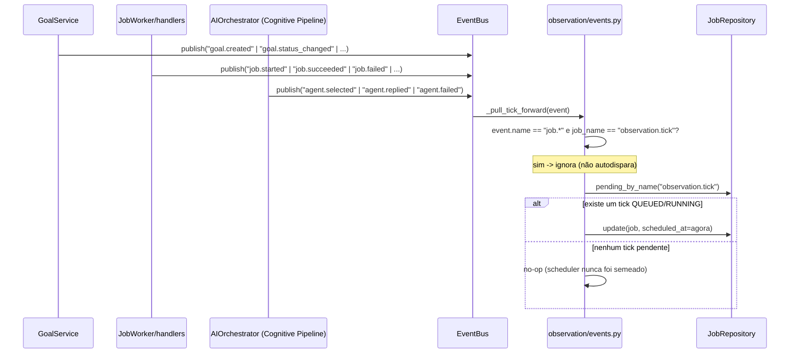
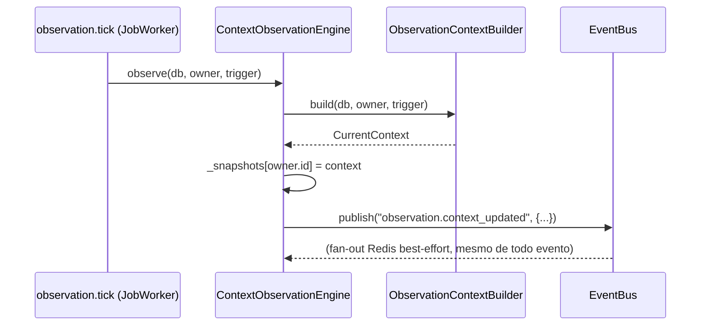

# Event Flow — Context Observation Engine

Como o [Context Observation Engine](OBSERVATION_ENGINE.md) usa o `EventBus` (`events/bus.py`) já existente para ficar orientado a eventos, sem introduzir nenhum canal novo. Duas direções: o engine **assina** eventos de outros domínios (para saber quando reagir mais cedo) e **publica** um evento próprio (para quem quiser saber quando uma fotografia nova ficou pronta).

## Assinaturas: o que dispara uma reação antecipada



`_TRIGGER_DOMAINS = ("goal.*", "job.*", "agent.*")` — assinaturas com curinga de domínio (`EventBus.subscribe` já suporta `"prefixo.*"`), não uma lista de nomes exatos de evento. Cobre qualquer evento novo que esses três domínios venham a publicar no futuro sem precisar tocar `observation/events.py` de novo.

**Por que `agent.*`**: é a reutilização real do Cognitive Pipeline pedida nesta missão — em vez do Observation Engine importar/chamar `CognitivePipeline`/`AIOrchestrator` diretamente (o que criaria uma dependência de execução entre um motor de observação e o motor de decisão, exatamente o tipo de acoplamento que `docs/architecture.md#por-que-não-existe-um-statemanager-central` já rejeita para outros casos), ele reage aos eventos que o Orchestrator já publica (`orchestrator/service.py::AIOrchestrator.run`). O Cognitive Pipeline nem sabe que o Observation Engine existe.

## Por que "puxar para frente" em vez de reconstruir na hora

O handler do evento (`_pull_tick_forward`) não chama `ContextObservationEngine.observe()` diretamente. Três razões, na ordem que mais importa:

1. **Isolamento de sessão.** `EventBus.publish` roda os handlers dentro do fluxo de quem publicou (ex: dentro de `GoalService.create_goal`, na mesma transação). Reconstruir a fotografia ali significaria abrir consultas extras na sessão de outro domínio, no meio da transação dele — risco de side effect inesperado se algo nessa reconstrução falhar.
2. **Não bloquear quem publicou.** Reunir sete fontes é mais trabalho que qualquer publisher deveria esperar de forma síncrona só para terminar sua própria operação (criar uma meta, por exemplo).
3. **Coalescer rajadas.** Várias metas/jobs/respostas de agente em sequência rápida (comum, ex: um plano do Cognitive Pipeline com 3 etapas publica 3× `agent.*`) resultam numa única reconstrução, não uma por evento — `pending_by_name` sempre encontra o mesmo job (ainda `QUEUED`) e só atualiza `scheduled_at`, nunca cria uma segunda linha.

O trabalho de fato (`ContextObservationEngine.observe`) só acontece dentro do `observation.tick` no `JobWorker` — mesmo lugar de sempre, sessão própria, sem competir com a transação de quem publicou o evento gatilho.

## Publicação: `observation.context_updated`



Payload:

```json
{
  "user_id": 1,
  "trigger": "scheduler",
  "generated_at": "2026-07-17T14:32:05+00:00",
  "item_count": 4,
  "degraded_sources": []
}
```

Ninguém assina esse evento dentro do backend ainda nesta milestone — ele existe para quem quiser (um futuro card no dashboard, uma automação n8n) reagir a "o estado do sistema mudou" sem fazer polling em `GET /api/observation` (que também não existe ainda; ver limitações em `docs/OBSERVATION_ENGINE.md`). Mesmo padrão de `agent.selected`/`agent.replied` (`orchestrator/service.py`): publicado para a "futura AI Console" observar, sem nenhum assinante interno hoje.

## Guard-rail: não autodisparar

`observation.tick` é, ele mesmo, um `Job` — processá-lo publica `job.started`/`job.succeeded` no `EventBus` (`jobs/events.py::JobEventPublisher`, mecanismo comum a todo job). Sem a checagem `event.payload.get("job_name") == JOB_NAME` em `_pull_tick_forward`, cada tick puxaria o **próximo** tick para agora assim que o atual terminasse — colapsando o intervalo de `OBSERVATION_INTERVAL_SECONDS` para zero e girando sem parar. Coberto por `tests/test_observation_events.py::test_observation_ticks_own_job_events_do_not_retrigger_themselves`.
