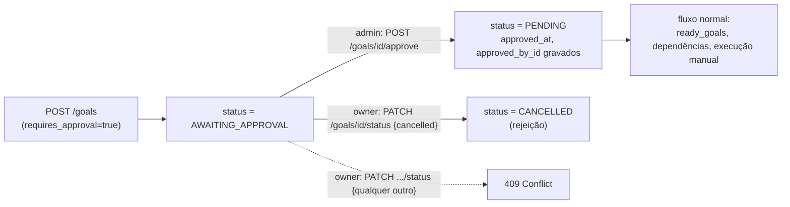

# GoalManager — Runtime Orchestrator, Milestone 1

Primeiro componente construído do zero da missão "Dario OS Orchestrator" (a camada de inteligência que coordena agentes). Diferente dos outros cinco componentes pedidos nessa missão — Orchestrator, Planner, Context Engine, Decision Engine, Execution Engine —, que já existiam em produção sob outros nomes (Cognitive Pipeline; ver `docs/architecture.md#dario-os-orchestrator`), **GoalManager não tinha nenhum equivalente**: é um domínio genuinamente novo.

## O que é um Goal (e o que não é)

Um `Goal` é um objetivo persistente que o dono do sistema (ou um agente, em nome dele) acompanha ao longo do tempo — com prazo, prioridade, dependências de outras metas e, opcionalmente, recorrência. **Não confundir com `Task`** (`models/task.py`, tools `create_task`/`list_tasks`/`complete_task`): `Task` é um lembrete simples de curta duração, sem dependências, sem recorrência, sem workflow de aprovação. `Goal` é o nível acima — um objetivo que pode levar dias/semanas, pode depender de outras metas terminarem primeiro, e pode exigir aprovação humana antes de começar.

Os dois domínios coexistem sem se sobrepor, mesmo padrão de isolamento por nome já usado para não confundir o calendário interno com o Google Calendar (ver `docs/CALENDAR.md#não-confundir-com-o-calendário-interno-do-dario-os`).

## Escopo desta milestone

| Capacidade pedida | Implementado |
| --- | --- |
| Metas persistentes | ✅ `models/goal.py::Goal` (Postgres) |
| Dependências entre metas | ✅ `GoalDependency` — grafo dirigido, com detecção de ciclo (direto e transitivo) na escrita |
| Prazos | ✅ `deadline` (nullable) |
| Metas recorrentes | ✅ `recurrence_interval_days` — ver seção própria abaixo |
| Pontuação de prioridade | ✅ `goals/scoring.py::priority_score` — determinística, testável isoladamente |
| Workflow de aprovação humana | ✅ status `AWAITING_APPROVAL` + `POST /api/goals/{id}/approve` (admin-only) |
| Histórico de execução | ✅ reaproveita a tabela `logs` já existente (`GET /api/goals/{id}/history`, owner-scoped) |
| Acompanhamento de progresso | ✅ `progress_percent` (0-100) |
| Sobreviver a um restart | ✅ estado 100% em Postgres; ver "O que 'resume after restart' significa aqui" abaixo — limite deliberado |
| Integração com o Event Bus | ✅ `goals/events.py::GoalEventPublisher` — mesmo idiom de `jobs/events.py` |
| Integração com o Memory Manager | ✅ best-effort: completar uma meta grava uma memória (`source="goal"`) |
| Integração com o Planner | ✅ tools de agente (`agents/tools/goals.py`), gateway único `assistant` — mesmo padrão dos outros domínios |

## O que "resume after restart" significa aqui (limite deliberado)

GoalManager é a camada de **persistência e ciclo de vida**, não um motor autônomo que executa metas sozinho. Nenhuma rotina hoje transiciona um Goal para `IN_PROGRESS` ou o executa via agentes automaticamente — isso é decisão explícita do usuário/agente através da API/tools. Por isso:

- O que **já é real**: o estado de um Goal (status, progresso, aprovação, dependências) é Postgres-backed e sobrevive a qualquer restart do backend sem nenhuma lógica especial — provado em `tests/test_goals.py::test_goal_state_survives_a_fresh_session`.
- O que **existe como base, mas não é consumido ainda**: `GoalRepository.stuck_in_progress(older_before)` — o equivalente de `JobRepository.stale_running_jobs` — encontra metas presas em `IN_PROGRESS` sem atualização de progresso há muito tempo. Nada chama essa query automaticamente hoje.
- O que **não existe**: um motor que decompõe um Goal em passos via `CognitivePlanner`, executa via `AgentExecutor`, e retoma exatamente de onde parou depois de um crash no meio da execução. Isso exigiria a integração Goal ↔ Orchestrator/Planner que a missão anterior (formalização do Runtime) deliberadamente adiou — ver `docs/architecture.md#dario-os-orchestrator`, seção "capacidades deliberadamente adiadas".

Nenhuma implementação-fachada foi criada para simular essa peça — o limite está documentado, não escondido atrás de um nome que sugere mais do que existe.

## Workflow de aprovação humana



Duas decisões deliberadas:
- **Só `approve_goal` pode tirar uma meta de `AWAITING_APPROVAL`** — o endpoint genérico `PATCH /goals/{id}/status` recusa (`409`) qualquer transição a partir desse status que não seja `CANCELLED`. Sem essa guarda, o gate de aprovação seria decorativo (qualquer chamador poderia contornar o requisito só usando o endpoint de status genérico).
- **Aprovação é admin-only, nunca uma tool de agente.** `agents/tools/goals.py` expõe `create_goal`, `list_goals`, `update_goal_progress`, `complete_goal` — nunca `approve_goal`. Um agente (LLM) nunca pode aprovar sua própria meta; `complete_goal_tool` numa meta `AWAITING_APPROVAL` retorna um erro estruturado no envelope da tool (nunca levanta, nunca contorna o gate) — ver `tests/test_goals.py::test_complete_goal_tool_on_awaiting_approval_goal_reports_error_without_raising`.

## Recorrência

Intervalo fixo em dias (`recurrence_interval_days`), não uma string cron/RRULE — daily/weekly/monthly são só 1/7/30, e o valor é validado (`>= 1`) e inteiro, sem precisar de um parser de expressão. Ao completar uma meta recorrente, `GoalService._spawn_next_occurrence` cria uma **nova linha** (nunca reseta a atual, para nunca perder histórico), com `recurrence_parent_id` sempre apontando para a meta **original** da cadeia — nunca para a ocorrência imediatamente anterior — então qualquer ocorrência encontra o início da cadeia com uma única consulta (`GoalRepository.recurrence_occurrences`).

## Pontuação de prioridade

`goals/scoring.py::priority_score(goal)` combina o peso da prioridade declarada (`LOW`/`MEDIUM`/`HIGH`/`URGENT`) com a proximidade do prazo: uma meta com prazo dentro de 14 dias ganha um bônus de urgência linear (até 50 pontos), zerado para prazos distantes ou inexistentes, e limitado (não cresce sem limite) para metas já muito atrasadas. `GoalService.ready_goals` ordena por esse score, não pela ordem de criação — função pura, testável sem banco (`tests/test_goals.py`, seção "Priority scoring").

## Dependências e detecção de ciclo

`GoalDependency` é uma aresta dirigida: `goal_id` não fica pronta (`ready_goals`) enquanto `depends_on_id` não estiver `COMPLETED`. Adicionar uma dependência que fecharia um ciclo (direto — uma meta depender de si mesma — ou transitivo, via BFS na cadeia de dependências do outro lado) é rejeitado com `CyclicDependencyError` (`409` na API) antes de gravar.

## Arquitetura

```
models/goal.py            Goal, GoalStatus, GoalPriority, GoalDependency
repositories/goal.py      GoalRepository — dependency_ids, is_blocked, add/remove_dependency,
                           recurrence_occurrences, stuck_in_progress
goals/
  service.py               GoalService — create_goal, approve_goal, add_dependency, ready_goals,
                            update_status, update_progress
  scoring.py                priority_score (função pura)
  events.py                  GoalEventPublisher — publica no Event Bus + grava em `logs`
  router.py                  /api/goals/* (CRUD, /ready, /approve, /status, /progress,
                              /dependencies, /history)
agents/tools/goals.py      create_goal, list_goals, update_goal_progress, complete_goal
                           (registradas só em assistant_agent.py — mesmo gateway único
                           dos outros domínios novos)
alembic/versions/23cd00e69ae5_*.py   tabelas goals + goal_dependencies
```

## Endpoints

| Método | Rota | Descrição |
| --- | --- | --- |
| `GET` | `/api/goals` | Lista as metas do usuário (filtro opcional `status`) |
| `GET` | `/api/goals/ready` | Metas `PENDING` sem dependência pendente, ordenadas por `priority_score` |
| `POST` | `/api/goals` | Cria uma meta |
| `GET` | `/api/goals/{id}` | Detalhe de uma meta |
| `GET` | `/api/goals/{id}/history` | Histórico de transições (owner-scoped, mesma tabela `logs`) |
| `POST` | `/api/goals/{id}/approve` | Aprova uma meta `AWAITING_APPROVAL` (**admin-only**) |
| `PATCH` | `/api/goals/{id}/status` | Transiciona status (rejeita saída de `AWAITING_APPROVAL` exceto para `CANCELLED`) |
| `PATCH` | `/api/goals/{id}/progress` | Atualiza `progress_percent` (0-100) |
| `POST` | `/api/goals/{id}/dependencies` | Adiciona uma dependência (rejeita ciclo) |
| `DELETE` | `/api/goals/{id}/dependencies/{depends_on_id}` | Remove uma dependência |

Todas as rotas (exceto `/approve`) são acessíveis ao próprio dono da meta — mesmo padrão de isolamento por `user_id` já usado em `Task`/`CalendarEvent`/`Note`. Cross-user sempre `404`, nunca `403` (não revela a existência da meta a quem não é dono).

## Testes

`tests/test_goals.py` (39 casos): criação/status/aprovação, dependências e ciclo (direto e transitivo), recorrência (spawn, cadeia sempre aponta pro original, meta não-recorrente não gera nada), progresso (clamp 0-100), sobrevivência de estado a uma nova sessão, `stuck_in_progress`, scoring (5 casos), EventBus + audit log, MemoryManager (sucesso e falha best-effort), as 4 tools de agente (incluindo o bloqueio do gate de aprovação via tool), e a API HTTP completa (CRUD, isolamento entre usuários, aprovação admin-only vs 403, 409 de ciclo e de gate de aprovação, 404 de dependência inexistente, 422 de progresso fora do range, `/ready` excluindo `AWAITING_APPROVAL`, histórico refletindo transições e owner-scoped).

## Limitações desta milestone

- UI no dashboard (`/metas`) lista as metas do usuário e permite criar
  (`components/goals/GoalForm.tsx`: título, descrição, prioridade, prazo,
  recorrência, `requires_approval`) e aprovar (botão "Aprovar", visível só
  para quem tem `role=admin`, verificado via `GET /auth/me` no cliente —
  a garantia real continua sendo o `require_admin` do backend). Ainda sem:
  editar/cancelar meta, gerenciar dependências, ou atualizar progresso
  pela UI — só pela API/tools.
- Recorrência não copia dependências para a próxima ocorrência (combinação deliberadamente fora de escopo — ver comentário em `GoalService._spawn_next_occurrence`).
- Nenhuma automação transiciona um Goal para `IN_PROGRESS`/`COMPLETED` sozinha — isso é ação explícita via API/tool, nunca um efeito colateral de outro fluxo (ex: o Cognitive Pipeline do WhatsApp não cria nem avança metas automaticamente nesta milestone).
