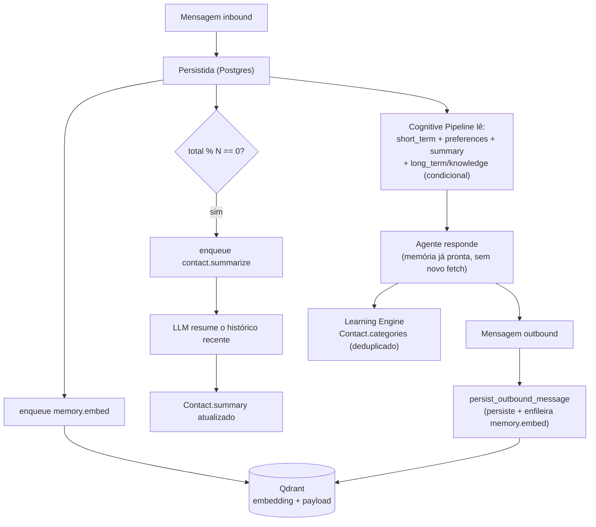

# Memória

`memory/manager.py::MemoryManager` é a única fachada que qualquer agente, ferramenta ou pipeline usa para ler ou escrever memória. Ela compõe peças já existentes e testadas (`MemoryService` sobre Qdrant, `ContactMemoryService`, os repositórios) — nunca as reimplementa, e nada fora de `memory/` toca Qdrant ou os campos de memória do `Contact` diretamente.

## Os seis tipos de memória

| Tipo | Método | Onde vive | Quando é usado |
| --- | --- | --- | --- |
| Curto prazo | `short_term(db, contact_id, limit)` | Postgres (`MessageRepository.recent_for_contact`) | Sempre que há `contact_id` — vira `history` (lista de `ChatMessage`) |
| Longo prazo | `long_term_search(query, contact_id, limit)` | Qdrant, busca semântica | Mensagens que não são conversa casual (Fase 4.2: gate por intenção/prioridade) |
| Conhecimento | `knowledge_search(query, limit)` | Mesma coleção Qdrant, filtrada por `source="knowledge"` | Intenções informacionais (pesquisa, pergunta, documento) |
| Preferências | `get_preferences` / `set_preference` | `Contact.preferences` (JSON) | Sempre que há `contact_id`; editável pela tool `update_contact_preference` |
| Resumo | `get_summary` | `Contact.summary` (mantido por `ContactMemoryService.summarize_contact`) | Sempre que há `contact_id` e já existe um resumo |
| Categorias/padrões | `add_categories` | `Contact.categories` (JSON) | Escrita apenas — o Learning Engine tagueia domínios recorrentes |

## Ciclo de vida de uma mensagem

Embedding e resumo **nunca** acontecem no hot path da requisição — ambos são jobs (`memory.embed`, `contact.summarize`), porque envolvem chamadas a serviços externos (LLM + Qdrant) que não devem atrasar a resposta ao webhook.

## Quando cada memória entra em jogo

- **Curto prazo vira `history`** — passado para `AIOrchestrator.run(history=...)` → `BaseAgent.run` → `Planner.build_messages`, que intercala o histórico entre o system prompt e a mensagem atual, como turnos de conversa reais (não como texto injetado no prompt).
- **Longo prazo, conhecimento, preferências e resumo viram `memories`** — uma lista de `{"source": ..., "content": ...}`, o mesmo formato que `MemoryManager.build_agent_context` já produzia antes da Fase 4.2. O Cognitive Pipeline só popula essa lista uma vez, para o plano inteiro, e passa adiante para cada etapa via `AIOrchestrator.run(memories=...)` — evita a mesma busca semântica se repetir por etapa.
- **Evitar contexto desnecessário é uma decisão explícita**: para uma saudação ou conversa casual (baixa prioridade), o pipeline pula a busca semântica inteiramente — só lê o que já é barato (curto prazo, preferências, resumo, todos Postgres local). `orchestrator.pipeline._needs_deep_context` é a função que decide isso, com base na prioridade e na intenção já classificadas.

## Resiliência

Toda leitura semântica (Qdrant) é protegida por `try/except` em dois pontos independentes — o auto-fetch original de `BaseAgent.run` (desde a Fase 3) e a nova leitura de contexto do Cognitive Pipeline (`CognitivePipeline._load_context`). Um Qdrant fora do ar nunca derruba uma resposta: o pipeline simplesmente segue sem aquele pedaço de contexto, registrando um aviso.

## Aprendizado (Fase 4.2)

`orchestrator/learning.py::LearningEngine` é deliberadamente pequeno — ele não tenta extrair fatos livres de uma conversa (isso seria um sistema de extração de conhecimento inteiro, fora de escopo). O que ele faz:

1. Olha quais agentes o plano usou (`store`, `church`, `personal`, `content`) e mapeia para um domínio (`loja`, `igreja`, `pessoal`, `conteudo`).
2. Chama `MemoryManager.add_categories`, que **deduplicaça na própria escrita** — uma categoria já presente em `Contact.categories` nunca é gravada de novo. "Evitar armazenamento redundante" é garantido na fronteira de persistência, não por quem chama.
3. Registra um log estruturado (`services.audit.record_log`, `source="cognitive_pipeline.learning"`) com a intenção, a prioridade e quais categorias (se alguma) foram adicionadas.

A embedding de cada mensagem e o resumo periódico continuam sendo responsabilidade da infraestrutura já existente (`ContactMemoryService`) — o Learning Engine não duplica isso, só adiciona a parte que faltava: reconhecer padrões de domínio ao longo do tempo.

## Referência de API

Ver a tabela completa de métodos em `docs/architecture.md#memory-manager`, e o fluxo de leitura/escrita do pipeline em `docs/architecture.md#fluxo-de-memória-fase-42`.
