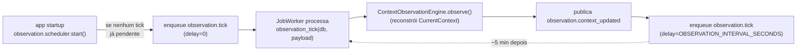

# Context Observation Engine

Motor que mantém uma fotografia (`CurrentContext`) do estado atual do mundo — metas, tarefas, agenda, eventos recentes, conversas, trabalho pendente e memória — sempre disponível para qualquer ponto de decisão consultar antes de agir, sem precisar reconsultar sete tabelas a cada chamada. Critério de sucesso da missão: **o sistema sempre sabe seu estado atual antes de tomar uma decisão**.

## Não confundir com o Context Engine do Cognitive Pipeline

`docs/architecture.md#dario-os-orchestrator` já documenta um "Context Engine": o próprio Cognitive Pipeline, via `orchestrator/context.py::ContextBuilder`. Os dois coexistem por serem coisas genuinamente diferentes:

| | `orchestrator/context.py::ContextBuilder` | `observation/builder.py::ObservationContextBuilder` |
| --- | --- | --- |
| Quando roda | Uma vez por mensagem recebida | Periodicamente (scheduler) + sob demanda (eventos) |
| Escopo | Uma conversa (`contact_id`) + o dono | Só o dono — visão do sistema inteiro |
| Gate de custo | `needs_deep_context` pula buscas caras em mensagens leves | Nenhum — sempre reúne as sete dimensões |
| Resultado | Descartado ao fim da requisição (`Context` local) | Cacheado em memória, consultável a qualquer momento (`ContextObservationEngine.current`) |
| Consumidor | Só `CognitivePipeline.process` | Qualquer ponto de decisão futuro (Cognitive Pipeline, um executor autônomo de Goals, uma view do admin) |

Nenhum dos dois substitui o outro. `ObservationContextBuilder` reaproveita a mesma forma de item (`{source, content}`) e a mesma filosofia best-effort (uma fonte que falha é pulada, nunca derruba a fotografia inteira) — mas não importa nem chama `orchestrator.context.ContextBuilder` diretamente, para não acoplar um ciclo de vida periódico a um ciclo de vida por mensagem.

## Escopo desta milestone

| Peça pedida | Implementado | Onde |
| --- | --- | --- |
| Context Observation Engine | ✅ `observation/engine.py::ContextObservationEngine` — cache em memória por `user_id`, `current()` (leitura síncrona), `observe()` (reconstrói + publica evento) | [Arquitetura](#arquitetura) |
| Agrega metas | ✅ `GoalService.ready_goals` — mesma chamada que o Cognitive Pipeline já usa | `observation/builder.py::_gather_goals` |
| Agrega tarefas | ✅ `Task` (status `PENDING`) | `observation/builder.py::_gather_tasks` |
| Agrega agenda | ✅ `CalendarEvent` (futuros, mais próximo primeiro) | `observation/builder.py::_gather_calendar` |
| Agrega eventos recentes | ✅ tabela `logs` (`LogEntry`) — a trilha de auditoria que todo domínio já escreve | `observation/builder.py::_gather_recent_events` |
| Agrega conversas | ✅ mensagens recentes (`MessageRepository`), qualquer contato | `observation/builder.py::_gather_conversations` |
| Agrega trabalho pendente | ✅ `Job` (`QUEUED`/`RUNNING`) via `JobRepository` | `observation/builder.py::_gather_pending_work` |
| Agrega memória | ✅ `Embedding` (metadados recentes, Postgres — não depende do Qdrant estar de pé) | `observation/builder.py::_gather_memory` |
| CurrentContext model | ✅ `observation/models.py::CurrentContext` — ver [`docs/CURRENT_CONTEXT.md`](CURRENT_CONTEXT.md) | — |
| Context Builder service | ✅ `observation/builder.py::ObservationContextBuilder` | — |
| Observation Scheduler | ✅ job auto-reagendável `observation.tick` rodando no `JobWorker` já existente — nenhum timer novo | [Scheduler](#observation-scheduler-sem-novo-timer) |
| Integração com Event Bus | ✅ assina `goal.*`/`job.*`/`agent.*`, publica `observation.context_updated` — ver [`docs/EVENT_FLOW.md`](EVENT_FLOW.md) | `observation/events.py` |
| Assíncrono | ✅ toda a cadeia é `async`/`await`, roda dentro do `JobWorker` (polling assíncrono já existente) | — |
| Orientado a eventos | ✅ eventos pulam a fotografia para frente em vez de esperar o próximo tick | `observation/events.py` |
| Observável | ✅ métricas Prometheus (`darioos_observation_*`) + `observation.context_updated` no Event Bus + log de fontes degradadas | [Observabilidade](#observabilidade) |
| Restart-safe | ✅ ver seção própria abaixo | [O que "restart-safe" significa aqui](#o-que-restart-safe-significa-aqui) |
| Totalmente testável | ✅ 36 testes (`tests/test_observation_*.py`) — unitários (builder, model, engine) + integração (scheduler, eventos, ponta a ponta com `JobWorker` real) | [Testes](#testes) |

Nenhuma infraestrutura nova: nenhum framework, registry, provider ou banco novo — tudo listado acima reaproveita `EventBus`, `GoalManager` (`GoalService`), o Cognitive Pipeline (via os eventos `agent.*` que ele já publica) e os repositórios existentes (`JobRepository`, `MessageRepository`, `GoalRepository` via `GoalService`, mais a mesma base `SQLAlchemyRepository` que `orchestrator/context.py` já usa para `Task`).

## O que "restart-safe" significa aqui

Mesmo raciocínio de honestidade que `docs/GOALS.md#o-que-resume-after-restart-significa-aqui-limite-deliberado` já aplica ao GoalManager:

- **O que é real**: a fotografia em si (`CurrentContext`) vive só em memória (`ContextObservationEngine._snapshots`) e **não sobrevive** a um restart — é descartável por design, porque tudo nela é derivado de tabelas que já são a fonte de verdade (`goals`, `tasks`, `calendar`, `logs`, `messages`, `jobs`, `embeddings`). O que sobrevive de verdade é a **cadeia de observação**: o próximo `observation.tick` já está persistido como uma linha `Job` (`status=QUEUED`, `scheduled_at` no futuro) antes de cada execução retornar. Um crash do processo não perde essa linha — o `JobWorker` (com sua própria recuperação de jobs presos em `RUNNING`, já testada em `tests/test_jobs.py`) a retoma no próximo processo, sem nenhum código de recuperação específico do Observation Engine. `tests/test_observation_integration.py::test_a_fresh_engine_instance_is_repopulated_from_the_same_job_chain` prova exatamente isso: uma instância nova de `ContextObservationEngine` (cache vazio, simulando um restart) é repovoada processando a mesma linha de `Job` que já existia antes.
- **O que não existe**: não há um buffer de "últimas N fotografias" nem qualquer histórico de `CurrentContext` — cada `observe()` sobrescreve a anterior. Quem precisa de histórico de estado já tem a tabela `logs` (uma das próprias fontes agregadas, `recent_events`) ou o histórico específico de cada domínio (`GET /api/goals/{id}/history`).
- **Janela de obsolescência**: entre um restart e o primeiro tick processado, `ContextObservationEngine.current(user_id)` retorna `None` — um chamador que precisa de garantia "nunca `None`" deve tratar esse caso (ex: cair para `orchestrator.context.ContextBuilder` por mensagem, que não depende de cache nenhum) em vez de assumir que a fotografia sempre existe. Documentado aqui para nunca virar uma suposição implícita.

## Observation Scheduler (sem novo timer)

Não existe um `Scheduler` novo. O `JobWorker` (`jobs/worker.py`) — polling assíncrono, claim atômico via `SELECT ... FOR UPDATE SKIP LOCKED`, retry com backoff, recuperação de jobs travados — já é o Scheduler canônico do runtime (`docs/architecture.md#dario-os-core-runtime`). `observation/scheduler.py` só registra um handler auto-reagendável:



`start()` é idempotente (`JobRepository.pending_by_name`) — um restart nunca cria uma segunda cadeia concorrente; a cadeia existente (persistida) só continua.

## Arquitetura

```
observation/
  models.py     CurrentContext, ContextItem — ver docs/CURRENT_CONTEXT.md
  builder.py     ObservationContextBuilder — as sete fontes, cada uma best-effort
  engine.py       ContextObservationEngine — cache em memória por user_id,
                   observe() (reconstrói + publica evento), current() (leitura),
                   is_stale(), reset() (só testes)
  scheduler.py     observation.tick (job_handler auto-reagendável) + start() (seed idempotente)
  events.py         assina goal.*/job.*/agent.* -> puxa o próximo tick para agora
repositories/job.py  + JobRepository.pending_by_name (única mudança em código existente)
main.py                wiring: registra o handler, assina os eventos, semeia o primeiro tick no lifespan
utils/config.py         OBSERVATION_ENABLED, OBSERVATION_INTERVAL_SECONDS, OBSERVATION_CONTEXT_LIMIT
observability/metrics.py darioos_observation_runs_total, darioos_observation_duration_seconds,
                          darioos_observation_source_errors_total
```

## Observabilidade

- `darioos_observation_runs_total{trigger}` — quantas fotografias foram construídas, por gatilho (`scheduler` | `startup`).
- `darioos_observation_duration_seconds` — duração de cada `build()`.
- `darioos_observation_source_errors_total{source}` — quantas vezes cada uma das sete fontes foi pulada (dependência fora do ar).
- `observation.context_updated` no Event Bus a cada `observe()` bem-sucedido — payload com `user_id`, `trigger`, `generated_at`, `item_count`, `degraded_sources`.
- `CurrentContext.degraded_sources` fica na própria fotografia — qualquer consumidor sabe, sem precisar consultar métricas, se alguma dimensão está incompleta agora.

## Testes

`tests/test_observation_builder.py` (14 casos) — cada uma das sete fontes isoladamente (presente/ausente conforme filtro de negócio, ex: metas `AWAITING_APPROVAL` excluídas, tarefas `DONE` excluídas, eventos passados excluídos), degradação best-effort (uma fonte falhando não derruba as outras), `trigger`/`user_id`/`item_count`/`is_empty`.

`tests/test_observation_engine.py` (7 casos) — cache vazio antes da primeira observação, `observe()` populando o cache, publicação do evento `observation.context_updated`, `is_stale`, `reset()`, isolamento por `user_id`.

`tests/test_observation_scheduler.py` (6 casos) — tick constrói a fotografia do dono, reagenda a si mesmo (delay correto), não quebra sem admin cadastrado ainda, `start()` semeia e é idempotente, `start()` respeita `OBSERVATION_ENABLED=false`.

`tests/test_observation_events.py` (6 casos) — eventos `goal.*`/`job.*`/`agent.*` puxam o tick pendente para agora; eventos do próprio `observation.tick` não se autodisparam; evento não relacionado não mexe no tick; nenhum tick pendente é no-op seguro.

`tests/test_observation_integration.py` (3 casos) — ponta a ponta com `JobWorker` real: seed → primeiro tick → fotografia; criação de meta via API real (`POST /api/goals`) → evento puxa o tick → fotografia reflete a meta nova; uma instância nova do engine (simulando restart) é repovoada pela mesma cadeia de job já persistida.

## Limitações desta milestone

- A fotografia é por `user_id`, mas hoje só o dono (`get_first_admin`) é observado — consistente com o resto do codebase, que já trata Dario OS como single-owner (`orchestrator/context.py`, `jobs/handlers.py::process_inbound_whatsapp_message`). Nada impede observar outros usuários no futuro; nenhum consumidor real precisa disso hoje.
- Nenhum ponto de decisão consome `ContextObservationEngine.current()` ainda — a integração com o Cognitive Pipeline, por ora, é só via os eventos que ele já publica (`agent.*`), não uma leitura direta dentro de `CognitivePipeline.process`. Mesma lógica de "capacidade sem consumidor real ainda" já documentada em `docs/architecture.md#capacidades-deliberadamente-adiadas`: o extension point existe (`context_observation_engine.current(user.id)`, leitura síncrona, sem I/O) e fica pronto para o dia em que um fluxo concreto precisar dele — não antecipado agora como comportamento novo do pipeline já em produção.
- `pending_work` mistura `QUEUED` e `RUNNING` num único corte de `OBSERVATION_CONTEXT_LIMIT` itens cada (não pondera por idade/prioridade) — suficiente para "o que está em andamento agora", não uma fila priorizada.
