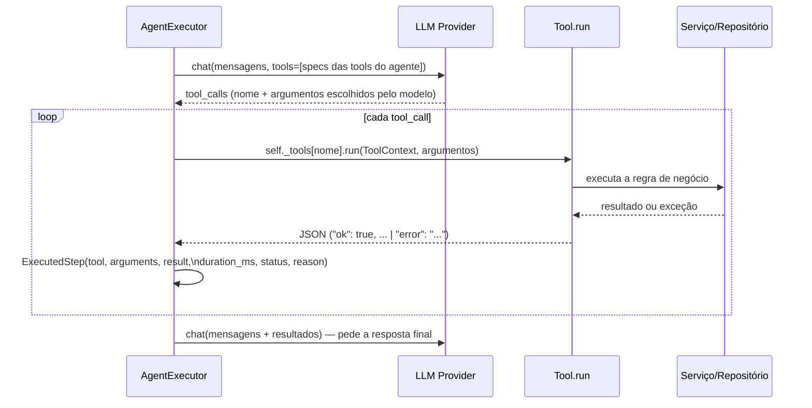

# Ferramentas (Tools)

Uma `Tool` é a unidade de function calling: um JSON Schema visível ao modelo mais um handler assíncrono que executa contra os serviços reais da aplicação. Toda ação que um agente pode tomar no mundo (criar tarefa, agendar evento, buscar cliente, gravar memória) passa por uma Tool — o modelo nunca toca o banco de dados diretamente.

## Anatomia de uma Tool

```python
# agents/tools/base.py
@dataclass
class Tool:
    name: str
    description: str
    handler: ToolHandler          # async (context: ToolContext, **arguments) -> str (sempre JSON)
    parameters: dict = field(default_factory=lambda: {"type": "object", "properties": {}, "required": []})

    def __post_init__(self) -> None:
        register_tool(self)       # auto-registro — a própria construção do objeto já é o registro
```

```python
# agents/tools/productivity.py
create_task_tool = Tool(
    name="create_task",
    description="Cria uma nova tarefa para o usuário.",
    parameters={
        "type": "object",
        "properties": {"title": {"type": "string"}, "priority": {"type": "string", "enum": ["low", "medium", "high"]}},
        "required": ["title"],
    },
    handler=_create_task_handler,
)
```

- **`__post_init__` é o registro.** Não existe uma lista central de ferramentas para editar — declarar `Tool(...)` em nível de módulo já registra a ferramenta no Tool Registry (`agents/tools/registry.py`). Um agente a torna disponível simplesmente listando-a em `self.tools`.
- **`handler` sempre devolve uma string JSON.** `Tool.run` (chamado pelo `AgentExecutor`) captura qualquer exceção do handler — `TypeError` (argumentos inválidos do modelo) vira `{"error": "Invalid arguments: ..."}`, qualquer outra exceção vira `{"error": "TipoDoErro: mensagem"}`. O modelo sempre recebe uma resposta estruturada, nunca um traceback.
- **`ToolContext(db, user)`** é tudo que um handler pode precisar, injetado pelo `AgentExecutor` — nenhuma ferramenta importa `get_db` ou monta sua própria sessão.

## Tool Registry

```python
# agents/tools/registry.py
_TOOLS: dict[str, Tool] = {}
def register_tool(tool: Tool) -> None: ...   # levanta DuplicateToolError se o nome já existe com outra instância
def get_tool(name: str) -> Tool | None: ...
def list_tools() -> list[Tool]: ...
```

`GET /api/agents/tools` expõe `list_tools()` — toda ferramenta do sistema, de qualquer agente, para descoberta.

## Como uma ferramenta é escolhida e executada

A regra é absoluta em todo o Dario OS, reforçada explicitamente na Fase 4.2: **nem o `agents.planner.Planner` nem o `orchestrator.planning.CognitivePlanner` chamam uma ferramenta**. Só o `AgentExecutor` o faz, e só com as ferramentas que o agente em execução declarou.



Cada chamada vira um `ExecutedStep` (`agents/executor.py`):

| Campo | Conteúdo |
| --- | --- |
| `tool` | nome da ferramenta chamada |
| `arguments` | argumentos exatamente como o modelo os enviou |
| `result` | a string JSON devolvida pelo handler |
| `duration_ms` | tempo de execução só da ferramenta (não da chamada ao LLM) |
| `status` | `"ok"` ou `"error"` — derivado do envelope JSON (`agents.executor.is_tool_error`) |
| `reason` | o texto que o modelo escreveu junto com a tool_call, quando escreveu algum |

Isso é auditabilidade real, não hipotética: `GET /api/chat` e `/api/agents/{name}/run` devolvem `steps` na resposta; o Cognitive Pipeline usa `status`/`result` para o `ResponseValidator` decidir se vale a pena tentar de novo (ver `docs/architecture.md#cognitive-pipeline-fase-42`); e `record_tool_call(tool, status)` alimenta `darioos_agent_tool_calls_total{tool,status}` no Prometheus.

## Catálogo de ferramentas por domínio

| Módulo | Ferramentas |
| --- | --- |
| `agents/tools/productivity.py` | `create_task`, `list_tasks`, `complete_task`, `create_event`, `list_events`, `create_note` |
| `agents/tools/communication.py` | `send_whatsapp_message`, `find_contact`, `search_memory`, `store_memory`, `update_contact_preference` |
| `agents/tools/domain.py` | `list_church_members`, `add_prayer_request`, `list_store_customers`, `add_store_customer` |
| `agents/tools/mail.py` | `search_emails`, `read_email_thread`, `summarize_email_thread`, `detect_pending_email_actions` — registradas **só** em `assistant_agent.py`; ver `docs/EMAIL.md` |
| `agents/tools/gcalendar.py` | `list_google_calendars`, `search_google_calendar_events`, `create_google_calendar_event`, `update_google_calendar_event`, `delete_google_calendar_event`, `check_google_calendar_availability` — registradas **só** em `assistant_agent.py`; ver `docs/CALENDAR.md` |
| `agents/tools/gcontacts.py` | `search_google_contacts`, `create_google_contact`, `update_google_contact`, `delete_google_contact` — registradas **só** em `assistant_agent.py`; ver `docs/CONTACTS.md` |
| `agents/tools/gdrive.py` | `list_google_drive_files`, `search_google_drive_files`, `read_google_drive_file`, `index_google_drive_file`, `index_google_drive_folder`, `summarize_google_drive_document`, `update_google_drive_index` — registradas **só** em `assistant_agent.py`; ver `docs/DRIVE.md`. Perguntas sobre o conteúdo indexado usam `search_memory` (linha acima), não uma tool nova. |

## Adicionando uma ferramenta nova

1. Escreva o handler async: `async def _my_handler(context: ToolContext, **kwargs) -> str: ...`, devolvendo `agents.tools.base.ok(**data)` no caminho feliz.
2. Declare `my_tool = Tool(name=..., description=..., parameters=..., handler=_my_handler)` em nível de módulo — o registro acontece sozinho.
3. Liste `my_tool` em `tools` do(s) agente(s) que devem usá-la.

Nenhum outro arquivo muda — nem o Tool Registry, nem o `AgentExecutor`, nem o Cognitive Planner (que só decide *qual agente*, nunca *qual ferramenta*).
