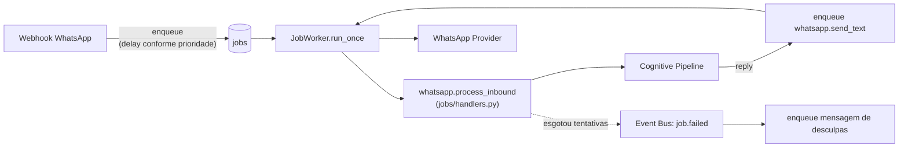

# Workflows e fila de jobs

"Workflow" no Dario OS tem dois sentidos que vale distinguir:

1. **A fila de jobs** (`jobs/`) — a infraestrutura durável e genérica que executa qualquer trabalho em segundo plano, com retry e agendamento. É o mecanismo.
2. **O hand-off para n8n** (`workflows/`) — uma automação externa específica, opcional, que roda em paralelo ao Cognitive Pipeline para quem já tem automações lá.

## Fila de jobs

```
jobs/
  registry.py    @job_handler(nome) — registro por decorator, mesmo padrão do Agent/Tool Registry
  service.py      JobService.enqueue(name, payload, delay_seconds, max_attempts)
  worker.py       JobWorker — claim atômico + execução + retry + recuperação de jobs travados
  handlers.py      handlers embutidos (ver tabela abaixo)
  events.py       publica job.started/succeeded/retry_scheduled/failed no Event Bus
```

- **Durável**: tabela `jobs` no Postgres, não uma fila em memória — sobrevive a um restart do processo.
- **Claim atômico**: `SELECT ... FOR UPDATE SKIP LOCKED` — múltiplas réplicas do worker nunca processam o mesmo job duas vezes.
- **Retry com backoff exponencial**: `JOBS_RETRY_BACKOFF_SECONDS * 2^tentativa`, até `max_attempts`; depois disso, `FAILED` com `last_error` preenchido.
- **Recuperação de jobs travados**: um job que ficou `RUNNING` por mais que `JOBS_STALE_AFTER_SECONDS` (o worker que o reivindicou provavelmente caiu) volta para `QUEUED`.
- **Prioridade de execução (Fase 4.2)**: `scheduled_at` já ordenava a fila (`JobRepository.due_jobs`, `ORDER BY scheduled_at ASC`); o webhook do WhatsApp agora usa isso de propósito — `orchestrator.priority.quick_priority_hint` (heurística, sem LLM, segura para o hot path) decide `delay_seconds` ao enfileirar `whatsapp.process_inbound`. Mensagens não-urgentes mantêm `delay_seconds=0` (idêntico ao comportamento anterior à Fase 4.2); mensagens urgentes são agendadas alguns segundos no passado — ficam devidas na hora **e** ordenam à frente de qualquer job já na fila com `scheduled_at` mais recente.

### Handlers embutidos

| Job | O que faz | Retry cobre |
| --- | --- | --- |
| `whatsapp.process_inbound` | Roda o **Cognitive Pipeline** (Fase 4.2) para a mensagem recebida e enfileira a resposta | LLM fora do ar, timeout de agente, erro de ferramenta |
| `whatsapp.send_text` | Envia via `WhatsAppProvider.send_text` + persiste + alimenta memória (`services/messaging.py`) | Gateway de WhatsApp fora do ar |
| `memory.embed` | Gera embedding de uma interação (fora do hot path da requisição) | Qdrant fora do ar |
| `contact.summarize` | Pede ao LLM um resumo atualizado do contato | LLM fora do ar |
| `workflow.trigger` | Dispara um workflow n8n (ver abaixo) | n8n fora do ar |

### Ciclo de vida observável

Todo job publica `job.started`/`job.succeeded`/`job.retry_scheduled`/`job.failed` no Event Bus (fan-out best-effort via Redis) e grava em `logs`, mesmo sem assinantes. Um subscriber real (`jobs/handlers.py::register_event_subscribers`, chamado explicitamente no startup) reage a `job.failed` do `whatsapp.process_inbound`: se o auto-reply esgota as tentativas, uma mensagem de desculpas é enfileirada — o contato nunca fica em silêncio, mesmo numa falha definitiva.

## O hand-off para n8n

`workflows/service.py::workflow_service.trigger(nome, dados)` dispara um webhook n8n configurado (`N8N_BASE_URL`). O webhook do WhatsApp sempre enfileira `workflow.trigger` (independente do Cognitive Pipeline) para quem quer estender o fluxo com automações externas sem tocar o backend. Os dois caminhos — Cognitive Pipeline e n8n — rodam **em paralelo** por padrão; `AUTO_REPLY_ENABLED=false` desativa o Cognitive Pipeline para quem prefere que só o n8n responda (evita duas respostas para a mesma mensagem).

## O Cognitive Pipeline como "o workflow" do WhatsApp

Do ponto de vista de "o que acontece quando uma mensagem chega", o Cognitive Pipeline (`orchestrator/pipeline.py`) é o workflow real — mas ele não é uma nova engine de workflow: é um handler de job como qualquer outro (`whatsapp.process_inbound`), composto pelos componentes cognitivos descritos em `docs/architecture.md#cognitive-pipeline-fase-42`. Retry, timeout de HTTP e recuperação de falha continuam sendo responsabilidade exclusiva da fila de jobs — o pipeline não reimplementa nenhum desses mecanismos.



## Gerenciamento

`GET/POST /api/jobs`, `POST /api/jobs/{id}/cancel`, `GET /api/jobs/handlers` — API administrativa (papel `admin`) para inspecionar e gerenciar a fila.
