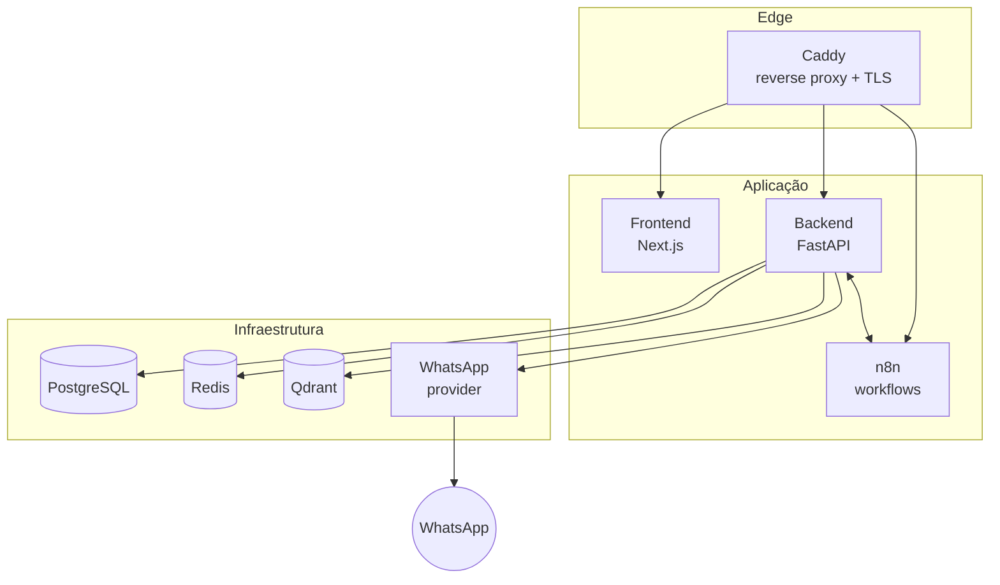
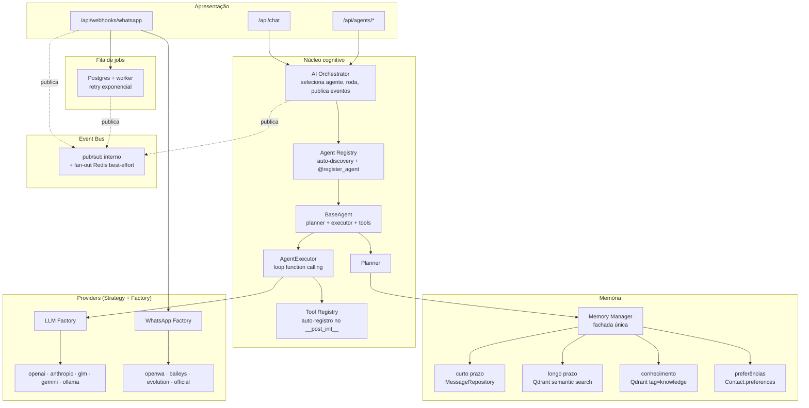

# Arquitetura do Dario OS

## Visão geral

O Dario OS é composto por 8 containers orquestrados pelo Docker Compose:



## Arquitetura interna do backend (Fase 3)

Três peças centrais consolidam a plataforma: o **Agent Registry** (quem existe), o **Tool Registry** (o que os agentes podem fazer) e o **AI Orchestrator** (como uma conversa é conduzida), com o **Event Bus** desacoplando quem produz um acontecimento de quem reage a ele.



## Camadas (Clean Architecture)

| Camada | Diretórios | Responsabilidade |
| --- | --- | --- |
| Apresentação | `api/`, `*/router.py`, `webhooks/` | HTTP, validação Pydantic, status codes |
| Coordenação cognitiva | `orchestrator/`, `agents/registry.py`, `agents/tools/registry.py` | Seleção de agente, descoberta de agentes/ferramentas, eventos de ciclo de vida |
| Aplicação | `auth/service`, `chat/service`, `jobs/service`, `memory/manager`, `agents/base` | Casos de uso e orquestração |
| Domínio | `models/` | Entidades (SQLAlchemy 2, tipagem forte) |
| Acesso a dados | `repositories/` | Repository pattern; nenhuma query fora daqui ou da fábrica CRUD |
| Infraestrutura | `providers/`, `database/`, `memory/service`, `services/`, `jobs/worker`, `events/bus` | Vendors, banco, Redis, Qdrant, pub/sub |

### Padrões aplicados

- **Repository Pattern** — `SQLAlchemyRepository[T]` genérico + repositórios especializados (`ContactRepository.get_or_create_by_phone`, `JobRepository.due_jobs`, ...). Rotas e serviços não montam queries.
- **Dependency Injection** — `Depends(get_db)`, `Depends(get_auth_service)`, `CurrentUser`; os factories de provider são funções puras substituíveis em teste.
- **Factory Pattern** — `providers/llm/factory.py`, `providers/whatsapp/factory.py`: seleção por configuração, sem `if` espalhado.
- **Strategy Pattern** — contratos `LLMProvider` e `WhatsAppProvider`; cada vendor é uma estratégia intercambiável (inclusive normalização de webhook por provider).
- **Registry + auto-discovery** (novo na Fase 3) — `agents/registry.py` e `agents/tools/registry.py` substituem o dicionário manual: um decorator (`@register_agent`) ou a própria construção do objeto (`Tool.__post_init__`) é o registro; `pkgutil.iter_modules` importa todo `agents/*_agent.py` automaticamente. Nenhum arquivo central lista agentes ou ferramentas.
- **Facade Pattern** (novo na Fase 3) — `memory/manager.py` unifica curto prazo, longo prazo, conhecimento e preferências atrás de uma API; `orchestrator/service.py` unifica seleção de agente + execução + eventos.
- **Observer / Pub-Sub** (novo na Fase 3) — `events/bus.py`: publicar não sabe (nem precisa saber) quem está ouvindo.
- **Service Layer** — regras de negócio (rotação de refresh token, resumo de contato, enfileiramento) vivem em serviços, não em rotas.
- **Open/Closed** — novo agente = arquivo + decorator (zero edição em código existente); nova ferramenta = arquivo + import; novo provider = classe + entrada no factory; novo job = decorator `@job_handler`.

## AI Orchestrator

`orchestrator/service.py` é o único ponto de entrada para "rodar uma conversa com um agente". Chat (`/api/chat`), a execução direta (`/api/agents/{name}/run`) e o auto-reply do WhatsApp (`jobs/handlers.py::process_inbound_whatsapp_message`) delegam aqui em vez de chamar `agents.registry.get_agent` + `agent.run(...)` cada um à sua maneira (era assim antes da Fase 3 — chat/service.py duplicava a busca de memória que `BaseAgent.run` já fazia).

Responsabilidades hoje:
1. Seleciona o agente pelo nome (`UnknownAgentError` se inválido — traduzido para 404 pelas rotas).
2. Publica `agent.selected` no Event Bus.
3. Roda o agente **sob timeout** (`AGENT_RUN_TIMEOUT_SECONDS`, `asyncio.wait_for`) — um LLM travado ou um loop de tools não trava o chamador para sempre; excedido, publica `agent.failed` e levanta `AgentTimeoutError` (a fila de jobs trata isso como qualquer outra falha: retry com backoff, depois `FAILED`).
4. Registra métricas Prometheus (`darioos_agent_runs_total`, `_run_duration_seconds`, `_tool_calls_total`, `_tokens_total`, `_cost_usd_total`) — um único lugar, nenhum chamador precisa se instrumentar.
5. Publica `agent.replied` com contagem de tool calls, memórias usadas, tokens consumidos e custo estimado.

Deliberadamente não decide *como* o agente pensa (isso é `BaseAgent`/`Planner`/`AgentExecutor`) nem *qual* memória usar (isso é `MemoryManager`) — é uma camada fina de coordenação, não mais um lugar para lógica de negócio. A evolução natural (Fase 4) é este método de seleção crescer de "nome explícito" para um classificador de intenção ou um Goal Planner, sem que nenhum chamador precise mudar.

O custo estimado usa uma tabela estática de preços por milhão de tokens (`providers/llm/base.py::estimate_cost_usd`) — aproximada por natureza (não substitui o faturamento real do provedor), mas suficiente como sinal operacional de custo por conversa/agente.

## Agent Registry e Tool Registry (arquitetura de plugin)

Instalar um agente novo é **só criar o arquivo**:

```python
# agents/weather_agent.py
@register_agent
class WeatherAgent(BaseAgent):
    ...
```

`agents/registry.py` importa automaticamente qualquer `agents/*_agent.py` (via `pkgutil.iter_modules`, executado uma vez, de forma preguiçosa, na primeira chamada a `get_agent`/`list_agents`) — o decorator roda no import e o agente já está disponível em `GET /api/agents`, `/api/chat` e `/api/agents/{name}/run`. Nenhum dicionário central para editar.

Ferramentas seguem o mesmo princípio, de forma ainda mais direta: `Tool` é um dataclass cujo `__post_init__` se registra sozinho no Tool Registry — a própria construção do objeto módulo-nível (`create_task_tool = Tool(...)`) é o registro. `GET /api/agents/tools` lista todas as ferramentas do sistema, de qualquer agente, para descoberta (base para o futuro AI Console).

## Event Bus

`events/bus.py` é um pub/sub assíncrono com dois destinos por publicação:
- **In-process**: assinantes (`event_bus.subscribe(nome, handler)`) rodam na mesma instância, sem serialização — é assim que módulos reagem a algo sem se importarem.
- **Redis (best-effort)**: a mesma publicação é replicada no canal `darioos:events` para outros processos (um worker dedicado futuro, o AI Console, uma métrica externa). Degrada silenciosamente se o Redis estiver fora; o caminho in-process nunca depende dele.

Não substitui a fila de jobs: eventos são *fire-and-forget* (sem retry, sem persistência garantida — use para notificação); qualquer coisa que precise sobreviver a uma queda do processo é um job, não um handler de evento.

Eventos publicados hoje: `whatsapp.message_received` (webhook), `agent.selected` / `agent.replied` / `agent.failed` (orchestrator), `job.started` / `job.succeeded` / `job.retry_scheduled` / `job.failed` (worker — migrado do antigo publisher Redis-only para o bus compartilhado, mesmo comportamento observável; o payload inclui `job_payload`, o payload original do job, para quem precisa agir sobre *o quê* falhou).

**Uso real na Fase 4.1**: o auto-reply do WhatsApp (`whatsapp.process_inbound`) é um job como qualquer outro — se esgotar as tentativas, o worker publica `job.failed`. Um subscriber registrado em `jobs/handlers.py::register_event_subscribers` (chamado explicitamente no startup, não como efeito colateral de import — importante para isolamento em testes, já que o reset de assinaturas entre testes derrubaria uma inscrição feita apenas na importação do módulo) reage a esse evento e enfileira uma mensagem de desculpas para o contato. Isso é o Event Bus fazendo trabalho real: o worker de jobs não conhece esse subscriber, e o subscriber não conhece o webhook — ambos só conversam através do evento.

## Memory Manager

`memory/manager.py` é a fachada única que qualquer agente ou serviço usa para memória — compõe peças já existentes e testadas, não as reimplementa:

| Tipo | Método | Implementação |
| --- | --- | --- |
| Curto prazo | `short_term(contact_id)` | `MessageRepository.recent_for_contact` (Postgres) |
| Longo prazo | `long_term_search(query, contact_id)` | Busca semântica no Qdrant (`MemoryService`) |
| Conhecimento | `knowledge_search(query)` | Mesma coleção Qdrant, filtrada por `source="knowledge"` — pronta para a ingestão de documentos da Fase 4 |
| Preferências | `get_preferences` / `set_preference` | `Contact.preferences` (JSON), modelado desde o início mas nunca exposto até agora — a tool `update_contact_preference` já usa este caminho |

`BaseAgent.run` chama `memory_manager.build_agent_context(...)` (que por sua vez delega ao já existente `ContactMemoryService.build_context`) para montar o contexto do planner — um único ponto de entrada em vez de cada chamador saber que a busca semântica vive em `memory/service.py`.

## Providers

```
providers/
  llm/        base.py (LLMProvider, ChatMessage, ToolSpec, LLMResult)
    openai/     chat completions + tools + embeddings
    anthropic/  messages API + tool_use (sem embeddings — EmbeddingsNotSupportedError)
    glm/        endpoint OpenAI-compatível da Zhipu (reaproveita OpenAIProvider por herança)
    gemini/     REST direto via httpx — sem SDK novo; function calling + embeddings próprios
    ollama/     endpoint OpenAI-compatível local (reaproveita OpenAIProvider por herança)
  whatsapp/   base.py (WhatsAppProvider, InboundMessage)
    openwa/     wa-automate easy-api
    evolution/  Evolution API (message/sendText etc.)
    baileys/    gateway REST sobre a lib Baileys
    official/   WhatsApp Cloud API (Meta Graph)
```

`LLM_PROVIDER` e `EMBEDDING_PROVIDER` são independentes porque nem todo vendor tem API de embeddings de dimensão previsível (Anthropic não tem API de embeddings; GLM e Ollama têm, mas com dimensão que não bate com a coleção Qdrant configurada — ambos levantam `EmbeddingsNotSupportedError` de propósito em vez de gravar vetores incompatíveis silenciosamente). Sem chave/endereço configurado, todo provider degrada para resposta stub — o sistema continua de pé.

Gemini foi implementado com `httpx` puro (já era dependência, usada pelos providers de WhatsApp) em vez do SDK oficial do Google — zero dependência nova. A única particularidade de tradução: Gemini não dá um `id` para cada chamada de função (diferente de OpenAI/Anthropic), então o provider sintetiza um id e mantém um mapa local `id → nome` ao converter a conversa, para devolver o resultado da ferramenta no formato `functionResponse` correto.

## Agentes

Um agente é composto por:

- **system prompt** — identidade e regras;
- **tools** — `Tool` = JSON Schema + handler async com `ToolContext(db, user)`; resultados voltam ao modelo como JSON;
- **memory** — `MemoryManager.build_agent_context` injeta memórias relevantes no contexto pelo planner;
- **planner** (`agents/planner.py`) — monta a lista de mensagens (prompt + memórias + pedido);
- **executor** (`agents/executor.py`) — loop de function calling: modelo → tool calls → resultados → ... até resposta final ou orçamento de iterações (`AGENT_MAX_ITERATIONS`).

O executor registra cada passo (`steps` na resposta da API) e quantas memórias foram usadas (`AgentResult.memories_used`), o que dá auditabilidade às ações dos agentes sem que o chamador precise recalcular nada.

## Memória por contato

1. Toda mensagem (entrada/saída) é enfileirada como job `memory.embed` (fora do hot path da requisição) e vira embedding no Qdrant (`payload: content, source, contact_id`) com metadados auditáveis na tabela `embeddings`.
2. `last_interaction_at` é atualizado a cada interação.
3. A cada `CONTACT_SUMMARY_EVERY_N_MESSAGES` mensagens, o job `contact.summarize` pede ao LLM um resumo do histórico recente e grava em `contacts.summary`.
4. Agentes recebem memórias relevantes via `MemoryManager.long_term_search` (filtrável por contato) e podem gravar novas com a tool `store_memory`, ou preferências estruturadas com `update_contact_preference`.

## Fluxo ponta a ponta do WhatsApp (Fase 4.1)

Ver o diagrama de sequência completo no [README](../README.md#fluxo-de-execução-whatsapp--ponta-a-ponta-automático). Pontos de arquitetura que valem detalhar aqui:

- **`services/messaging.py::persist_outbound_message`** é o único lugar que persiste uma mensagem de saída e alimenta a memória do contato — usado tanto por `api/whatsapp.py` (envio manual via dashboard) quanto pelo job `whatsapp.send_text` (envio automático, seja pela resposta do agente ou por uma tool `send_whatsapp_message`). Antes da Fase 4.1, só o caminho da API fazia isso — o envio via fila silenciosamente pulava persistência e memória; extrair a função fechou essa lacuna nos dois lugares de uma vez.
- **`whatsapp.process_inbound`** (`jobs/handlers.py`) é o job que roda o AI Orchestrator para o agente `assistant`, agindo em nome do **primeiro usuário admin** (`UserRepository.get_first_admin`) — Dario OS é um sistema de dono único, então ações de ferramentas disparadas por uma mensagem de WhatsApp (criar tarefa, agendar evento) pertencem ao dono da instância, não ao contato que escreveu.
- **Deduplicação**: o webhook verifica `external_id` antes de processar (uma redelivery do provider não gera nem resposta duplicada, nem embedding duplicado, nem job duplicado); uma constraint única em `messages.external_id` cobre a corrida entre requisições concorrentes (mesmo padrão de recuperação de `IntegrityError` já usado em `ContactRepository.get_or_create_by_phone`).
- **Assinatura do webhook**: `WhatsAppProvider.verify_signature(raw_body, headers)` (novo método na Strategy, com default no-op) permite que cada provider valide seu próprio esquema — `OfficialProvider` implementa HMAC-SHA256 real (`X-Hub-Signature-256`, o esquema da Meta); os demais seguem cobertos pelo `WEBHOOK_SECRET` compartilhado.
- **Loop/flood**: `RateLimiter.is_allowed` ganhou parâmetros opcionais de limite/janela (retrocompatível — sem eles, usa o limite HTTP global) para servir também como o freio de auto-reply por contato, sem duplicar lógica de rate limiting.
- **Nunca fica em silêncio**: se `whatsapp.process_inbound` esgota as tentativas, o Event Bus (`job.failed`) aciona uma mensagem de desculpas — ver seção Event Bus acima.

## Fila de jobs

- Tabela `jobs` (durável) + worker assíncrono iniciado no lifespan da API.
- Claim atômico com `SELECT ... FOR UPDATE SKIP LOCKED`: múltiplas réplicas do worker nunca processam o mesmo job duas vezes.
- `scheduled_at` permite agendamento; retry com backoff exponencial (`JOBS_RETRY_BACKOFF_SECONDS * 2^tentativa`) até `max_attempts`, depois `failed` com `last_error`; jobs órfãos (`RUNNING` após crash) são recuperados a cada tick.
- Eventos de ciclo de vida (`job.started`/`succeeded`/`retry_scheduled`/`failed`) são publicados no Event Bus (fan-out em `darioos:events`) e sempre persistidos em `logs`, mesmo sem assinantes.
- Por ser Postgres-backed, workers adicionais podem rodar em containers separados sem mudar o lado que enfileira.
- **Correção de robustez (Fase 4.1)**: quando um lote de jobs devidos inclui mais de um job (comum no fluxo do WhatsApp: `memory.embed`, `workflow.trigger` e `whatsapp.process_inbound` ficam devidos juntos), a falha de um job antigo `session.rollback()`ava a sessão compartilhada e expirava os objetos dos jobs seguintes do MESMO lote — o próximo acesso a um atributo (ex: `job.id` ao publicar o evento `started`) tentava um refresh implícito fora de um contexto async válido e derrubava com `MissingGreenlet`. `run_once()` agora captura os ids do lote antes de qualquer execução e re-busca cada job explicitamente (`repository.get(job_id)`, uma consulta segura e aguardada) antes de rodá-lo — nenhum job do lote fica vulnerável ao rollback de outro.

## Autenticação e permissões

- Access token JWT curto (30 min) + refresh token rotativo de 30 dias.
- Refresh tokens armazenados como hash SHA-256; rotação revoga o anterior; reuso de token revogado é rejeitado (mitiga replay); expirados são purgados a cada novo login.
- RBAC: papel `admin` (primeiro usuário) e `user`; `require_roles(...)` protege rotas administrativas (`/api/logs`, `/api/jobs`).
- `WEBHOOK_SECRET` (opcional): quando definido, `/api/webhooks/whatsapp` exige `X-Webhook-Token`.

## Migrações

Alembic com `env.py` async lendo `DATABASE_URL` das settings. O container do backend executa `alembic upgrade head` antes do uvicorn. Autogenerate: `alembic revision --autogenerate -m "..."`.

## Observabilidade

- **Liveness** `/health`, **readiness** `/health/ready` (Postgres obrigatório; Redis/Qdrant marcam `degraded`).
- **Métricas** `/metrics` (Prometheus): HTTP (`darioos_http_requests_total`/`_duration_seconds`), agentes (`darioos_agent_runs_total{agent,provider,status}`, `_run_duration_seconds`, `_tool_calls_total`, `_tokens_total`, `_cost_usd_total`) e jobs (`darioos_job_duration_seconds{name}`) — todas com o template da rota/nome, não a URL/id bruto, para manter a cardinalidade baixa; probes isentos de rate limit.
- **Tempo por etapa**: cada chamada de ferramenta (`ExecutedStep.duration_ms`) e cada execução de agente (`AgentResult.duration_ms`) carregam sua própria medição, visível na resposta da API sem precisar consultar o Prometheus.
- **Logs estruturados** em JSON (`LOG_JSON=true`), um objeto por linha, prontos para Loki/ELK.
- **Auditoria** na tabela `logs` (webhooks, eventos de jobs) e no Event Bus (`agent.selected`/`agent.replied`/`agent.failed`, base para o futuro AI Console).

## Decisões e trade-offs

- Worker de jobs no mesmo processo da API por padrão (simplicidade); a fila durável e o claim atômico já permitem extrair para container dedicado quando a carga justificar, sem mudar nenhum código de enfileiramento.
- O webhook do WhatsApp é público por necessidade; proteja-o na borda (rede Docker/Caddy, `WEBHOOK_SECRET`, `OFFICIAL_APP_SECRET`) e prefira providers com autenticação de webhook.
- O provider Baileys pressupõe um gateway REST na frente da lib Node; o layout de endpoints é configurável via `BAILEYS_BASE_URL`.
- O Event Bus é aditivo: a maior parte dos fluxos ainda é chamada direta (síncrona) por decisão — reescrever tudo para "só eventos" trocaria simplicidade e rastreabilidade por um desacoplamento que ninguém está pedindo hoje. Ver `docs/fase3-relatorio.md` para a justificativa completa dessa fronteira.
- O auto-reply (`whatsapp.process_inbound`) e o hand-off legado ao n8n (`workflow.trigger`) rodam **em paralelo** por padrão — quem já usa n8n para gerar a resposta deve desativar `AUTO_REPLY_ENABLED` para o contato não receber duas respostas à mesma mensagem.
- **Nota de transparência sobre cobertura de testes**: `webhooks/router.py` e os handlers de envio em `api/whatsapp.py` mostram uma cobertura de linha aparentemente baixa na ferramenta `coverage.py` (investigado a fundo: não é cache de bytecode, não é ordem de import, não é specífico do plugin `pytest-cov` — reproduz com `coverage run` puro). A correção comportamental dessas rotas está provada por asserções diretas em ~20 testes de integração (status HTTP correto por cenário, linhas exatas persistidas no banco, payloads exatos de job) — evidência mais forte que a métrica de linha para este caso específico. Ver `docs/fase4.1-relatorio.md` para os detalhes da investigação.
