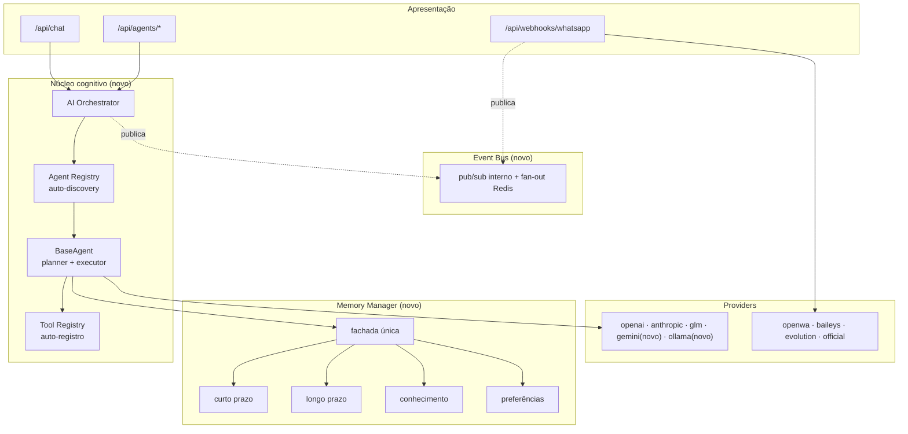

# Fase 3 — Consolidação Arquitetural do Dario OS

**Escopo desta entrega**: consolidar a arquitetura para crescimento futuro (itens 1–9 solicitados: Agent Registry, Tool Registry, Event Bus, AI Orchestrator, separação Planejamento/Execução/Memória/Ferramentas, providers multi-LLM, Memory Manager, plugin por pasta, documentação). Nenhuma funcionalidade de negócio nova foi implementada — como instruído, "primeiro consolide a arquitetura".

O segundo bloco de pedidos (Goal Planner, Knowledge Engine, Context Manager, AI Supervisor, agentes colaborativos, Reflection Engine, AI Console, MCP, Plugin SDK empacotado) foi **deliberadamente não implementado nesta entrega** — é tratado como roadmap de Fase 4 priorizado ao final deste relatório, com a justificativa de por que entrar direto nessas 16 frentes de uma vez seria exatamente o overengineering que foi pedido para evitar. A base construída agora (registries, orchestrator, event bus, memory manager) é o alicerce sobre o qual cada um desses itens é construído sem retrabalho.

## 1. Arquitetura atual (antes desta fase)

- Agentes registrados em um dicionário manual (`agents/registry.py`), instanciados um a um, importado explicitamente por nome.
- Ferramentas (`Tool`) importadas diretamente por cada agente; nenhuma forma de listar "todas as ferramentas do sistema".
- `chat/service.py` chamava `agents.registry.get_agent` e duplicava a busca de memória que `BaseAgent.run` já fazia internamente, só para calcular uma contagem.
- Módulos se chamavam diretamente sem um canal de eventos — o webhook conhecia n8n via job, mas nada mais podia "escutar" uma mensagem chegando sem editar o webhook.
- Memória fragmentada em `memory/service.py` (embeddings brutos) e `memory/contact_memory.py` (orquestração por contato); o campo `Contact.preferences` existia no modelo desde a Fase 1 mas nunca foi lido ou escrito por nenhum código.
- Providers de LLM: openai, anthropic, glm.

## 2. Arquitetura após a consolidação

Ver `docs/architecture.md` para o diagrama completo (incluindo a fila de jobs e a infraestrutura Docker) e o detalhamento de cada componente.

## 3. Decisões arquiteturais e justificativas

| Decisão | Por quê |
| --- | --- |
| Agent Registry por decorator + auto-discovery (`pkgutil`), não um dict manual | Item 8 explícito: "instalar apenas adicionando uma nova pasta". Testado: `test_register_agent_installs_a_new_agent_with_zero_core_changes`. |
| Tool Registry via `__post_init__` do dataclass `Tool` | Zero mudança nos 15 tools já existentes — o registro é a própria construção do objeto, não um passo extra que autores de tools precisam lembrar. |
| AI Orchestrator como camada fina (seleciona, roda, publica eventos) — não decide "como pensar" nem "qual memória usar" | Single Responsibility: se o Orchestrator também decidisse plano de tarefas ou fonte de memória, ele viraria um Deus-objeto. Isso é reservado para o Goal Planner (Fase 4), que se apoiará neste ponto único de entrada sem reescrevê-lo. |
| Event Bus com dois destinos (in-process + Redis best-effort), não "só Redis" | O caminho crítico (ex: worker de jobs reagindo a eventos) não pode depender de uma infra externa estar de pé; a auditoria em `jobs/events.py` já seguia esse princípio e foi generalizada, não substituída por algo mais frágil. |
| Event Bus não substitui a fila de jobs | Eventos são fire-and-forget (sem retry, sem persistência garantida); qualquer coisa que precise sobreviver a um crash continua sendo um job. Confundir os dois foi o erro que a auditoria da Fase 2 já corrigiu para jobs — não repetir aqui. |
| Memory Manager como Facade sobre serviços já testados, não uma reimplementação | `MemoryService` e `ContactMemoryService` continuam existindo e são os únicos que tocam Qdrant/Postgres diretamente; o Manager só compõe. Reduz o raio de mudança de qualquer alteração futura de storage a um lugar. |
| `AgentResult.memories_used` carregado desde `BaseAgent.run` | Eliminou a duplicação real encontrada em `chat/service.py` (buscava memória duas vezes, uma para contar, outra dentro do agente) sem perder o campo `memories_used` da resposta pública — compatibilidade total. |
| Gemini via `httpx` puro, não o SDK oficial do Google | "Não introduza dependências desnecessárias." `httpx` já é dependência (usado pelos providers de WhatsApp); a API REST do Gemini é simples o bastante para não justificar mais um SDK. |
| Ollama e GLM como subclasses de `OpenAIProvider` | Ambos expõem endpoint compatível com a API da OpenAI — herança é reaproveitamento real, não duplicação disfarçada. |
| Ollama/GLM bloqueiam embeddings com `EmbeddingsNotSupportedError` | Dimensão de embedding incompatível com a coleção Qdrant configurada é um jeito de corromper a busca semântica silenciosamente. Bloquear com uma mensagem clara é mais robusto que "funcionar errado". |
| Preferências do contato expostas via Memory Manager + nova tool `update_contact_preference` | O campo já existia no modelo desde a Fase 1, sem nenhum código o usando — uma lacuna real, não uma feature nova inventada. |

## 4. Débitos eliminados nesta fase

- Duplicação de busca de memória entre `chat/service.py` e `BaseAgent.run`.
- Registro manual de agentes (um dicionário para editar a cada novo agente) — violava o próprio objetivo do sistema de plugin.
- Ausência de qualquer forma de descobrir ferramentas disponíveis no sistema (pré-requisito para o futuro AI Console).
- Campo de modelo (`Contact.preferences`) morto — modelado mas nunca lido/escrito.
- Acoplamento direto entre webhook e "quem processa a mensagem" (agora publica um evento; quem quiser reagir se inscreve, sem o webhook saber).

## 5. Compatibilidade

Nenhum contrato de API mudou. Especificamente verificado:
- `ChatResponse.memories_used` continua populado com o mesmo significado (agora vem de `AgentResult` em vez de ser recalculado em `chat/service.py`).
- `GET /api/agents` retorna os mesmos 5 agentes, mesmos campos.
- Todos os 59 testes pré-existentes da Fase 2 passam sem nenhuma alteração de asserção.
- `jobs/events.py` mantém a mesma assinatura pública (`job_event_publisher.publish(db, job, event, detail)`) — a migração para o Event Bus compartilhado é interna.

## 6. Métricas antes/depois

| Métrica | Antes (Fase 2) | Depois (Fase 3) |
| --- | --- | --- |
| Testes automatizados | 59 | 96 (+37) |
| Cobertura de linhas (backend) | 86% | 88% |
| Agentes registrados | 5 (dict manual) | 5 (auto-discovery; adicionar o 6º = 1 arquivo) |
| Ferramentas descobríveis via API | 0 (sem endpoint) | 15 (`GET /api/agents/tools`) |
| Provedores de LLM | 3 (openai, anthropic, glm) | 5 (+ gemini, ollama) |
| Dependências Python novas | — | 0 (Gemini via `httpx` já existente) |
| Módulos com responsabilidade única nova | — | `orchestrator/`, `events/`, `memory/manager.py`, `agents/tools/registry.py` |
| Pontos de acoplamento direto webhook→processamento | 1 (chamada direta) | 0 (evento publicado; job continua existindo em paralelo) |

## 7. Riscos remanescentes

1. **Event Bus in-process não sobrevive a múltiplas réplicas do backend** para assinantes que só existem in-process — hoje isso é aceitável porque não há assinantes de produção além dos publishers (o bus é usado para publicar, não para lógica de negócio crítica ainda). Se a Fase 4 adicionar um assinante que *precisa* rodar exatamente uma vez por evento entre réplicas, ele deve consumir do canal Redis, não da lista in-process.
2. **Gemini function calling sem id nativo** — o id sintetizado funciona porque o provider controla os dois lados da conversão dentro de uma única chamada; um futuro streaming ou paralelismo de tool calls precisaria revisar essa suposição.
3. **`qdrant_client.search` deprecado** (herdado da Fase 2) — ainda não migrado para `query_points`.
4. **Preferências sem validação de schema** — `set_preference` aceita qualquer `key`/`value`; se a Fase 4 expuser preferências no dashboard, provavelmente quer uma lista de chaves conhecidas.
5. **Nenhum destes riscos é novo em relação à Fase 2** — a consolidação não introduziu superfícies de ataque ou gargalos novos; ela reorganizou código existente.

## 8. Sugestões de evolução (além do roadmap formal abaixo)

- Quando a Fase 4 adicionar o primeiro handler "importante" no Event Bus (por exemplo, uma reação automática a `whatsapp.message_received`), considerar mover esse handler específico para consumir do Redis em vez do in-process, se precisar de garantia entre réplicas.
- O `KNOWLEDGE_SOURCE = "knowledge"` já reservado em `MemoryManager.knowledge_search` é o ponto de extensão pronto para a ingestão de documentos — a Fase 4 só precisa escrever nele, não redesenhar a busca.

---

# Roadmap Fase 4 (priorizado)

A lista original de 16 itens do pedido foi triada por **valor real vs. complexidade introduzida**, seguindo a própria instrução de evitar overengineering. Ordem de implementação sugerida:

### P0 — Fecha o ciclo do produto
1. **Goal Planner** (decomposição de objetivo em tarefas) — maior valor cognitivo pedido; usa o Orchestrator e o Tool Registry já existentes (o planner só precisa gerar uma lista de chamadas a `create_task`/`create_event`/`send_whatsapp_message` já registradas). Não requer infraestrutura nova.
2. **Resposta automática ponta a ponta sem depender do n8n** (já recomendado na Fase 2) — hoje o Orchestrator existe mas nada o chama automaticamente a partir do webhook; ligar `whatsapp.message_received` a uma execução do agente `assistant` via job é o item que torna o produto funcional sem automação externa.

### P1 — Qualidade cognitiva com baixo custo de infraestrutura
3. **AI Supervisor (versão mínima)**: detectar apenas dois casos concretos — loop (mesma tool chamada 3x com os mesmos argumentos) e resposta vazia — reaproveitando os `steps` que o executor já registra. Não é um subsistema novo, é uma checagem sobre dado que já existe.
4. **Reflection Engine (versão mínima)**: para tarefas com Goal Planner, gravar um resumo pós-execução (o que funcionou/falhou) como uma memória de "aprendizado" via `MemoryManager.remember(..., source="learning")` — reaproveita a fachada de memória, não cria um motor novo.

### P2 — Observabilidade cognitiva
5. **AI Console (leitura)**: painel no dashboard consumindo o que já existe — `GET /api/agents`, `GET /api/agents/tools`, `GET /api/jobs`, `GET /api/logs`, eventos do bus. Sem isso, nenhum item acima é auditável pelo usuário final.

### P3 — Expansão deliberadamente adiada
6. **Knowledge Engine (ingestão de documentos)** — real e valioso, mas é uma feature de produto (upload, extração de texto, resumo, vetorização) que merece design próprio; a superfície de leitura (`knowledge_search`) já está pronta para recebê-la.
7. **Context Manager (compressão/priorização automática de janela)** — só compensa quando o histórico realmente estourar o limite de contexto na prática; medir antes de construir.
8. **Agentes colaborativos (múltiplos agentes na mesma tarefa)** — depende do Goal Planner existir primeiro; sem ele, "colaboração" é só um agente chamando outro sem coordenação real.
9. **MCP (Model Context Protocol)** — o `Tool`/`ToolSpec` atual já é estruturalmente compatível (JSON Schema de parâmetros); adotar o protocolo formalmente é um adaptador sobre o Tool Registry existente, não uma reescrita — mas só vale a pena quando houver um cliente MCP externo real para conectar.
10. **Plugin SDK empacotado** (instalável via pip/CLI) — a arquitetura de plugin já funciona (arquivo + decorator); embalar isso como um pacote distribuível só se justifica quando houver plugins de terceiros de fato.

### Fora de escopo até haver sinal concreto de necessidade
- Multi-tenancy real (hoje é uma instância pessoal por design).
- Kubernetes / múltiplos workers dedicados (a fila já suporta; extrair só quando o volume justificar).
- Mais provedores de LLM/WhatsApp além dos 5+4 já cobertos.

## Lista de riscos (consolidada)

| Risco | Impacto | Mitigação recomendada |
| --- | --- | --- |
| Event Bus in-process não garante entrega única entre réplicas | Médio (só relevante quando houver assinante crítico) | Consumir do Redis para handlers que precisam de garantia entre processos |
| Gemini synthesized tool-call id não sobrevive a paralelismo de calls | Baixo (Gemini ainda não usado em produção) | Revisitar ao adotar tool calls paralelos |
| `qdrant_client.search` deprecado | Baixo (funcional) | Migrar para `query_points` na próxima atualização da lib |
| Preferências sem schema validado | Baixo | Definir enum de chaves conhecidas antes de expor no dashboard |
| Tokens em `localStorage` (herdado da Fase 2) | Médio | Cookies httpOnly — já no roadmap anterior |

## Sugestões de evolução (resumo executivo)

Consolidar antes de expandir foi a escolha certa: os 5 componentes construídos nesta fase (Agent Registry, Tool Registry, Orchestrator, Event Bus, Memory Manager) são exatamente os blocos sobre os quais o Goal Planner, o AI Supervisor e o Reflection Engine da Fase 4 serão construídos — sem eles, cada um desses itens teria reinventado descoberta de agentes, execução de ferramentas ou acesso a memória à sua própria maneira. A recomendação é seguir o roadmap P0→P3 acima em ordem, medindo uso real antes de avançar para os itens P3.
